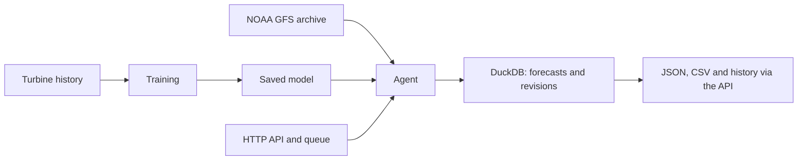

# Windcast — wind farm power output forecast

[Русский](README.md) · **English** · [Қазақша](README.kk.md)

**Hourly power forecast for two wind turbines, 24–48 hours ahead.**
The agent fetches a weather forecast, runs the trained model, analyzes the result
and stores the history of runs. Such a forecast helps plan generation
and see expected changes in power output ahead of time.

A RentBox team project for **HackAlem AI**, "Energy" track.
The test period set by the task is **1–28 February 2026**.

The model outputs **normalized power from 0 to 1** — this is the form in which output
is recorded in the source data: 0 means the turbine produces nothing, 1 is the maximum
found in the history. It cannot be converted into physical megawatts until
the organizers provide the rated capacity of the turbines.

[Quick start](#quick-start) · [What is ready](#what-already-works) ·
[Results](#forecast-quality) · [How the agent works](#how-the-agent-works) ·
[Verification](#verifying-the-main-scenario) · [Plans](#what-we-wanted-to-do-but-did-not-have-time-for) ·
[Limitations](#known-limitations)

## Why it matters

A wind farm declares an hourly generation schedule to the grid operator in advance and pays
for deviating from it. The more accurate the forecast, the smaller the imbalance and the less reserve
capacity the power system has to keep.

- **The forecast error is half that of a simple rule.** The mean absolute
  error (MAE) for January is 0.15947 versus 0.34268 for the "same as the
  last known hour" forecast, i.e. 53.5% lower. The comparison was made
  on identical forecast rows with horizons of 1–48 hours.
- **Scenario estimate of lost generation — about 226 MWh per year.** Zero power
  at wind speeds of 6–12 m/s occurs in 2.2% of records for the first turbine and 1.5% for the second.
  Assuming a rated capacity of 2.5 MW and a tariff of 25–30 ₸/kWh, the estimate is
  **5.65–6.78 million ₸ per year**. The rated capacity, tariff and causes of zero power need
  confirmation. The breakdown is in the [backlog](docs/BACKLOG.md).
- **Comparing the turbines helps spot possible downtime.** In June 2024 the share of
  records with zero power at 6–12 m/s wind was 22.2% for the first
  turbine and 0.0% for the second; in February 2025 — 0.9% and 6.9% respectively.
  The reasons for the differences must be checked against site conditions and operation logs.

## Quick start

**You need:** Git, Bash, `curl` and a running Docker with Compose 2.24+.
Linux, macOS or Windows via WSL2 will do. If Docker is unavailable, the script can
run the backend through an installed `uv`. **No GPU or API keys are needed.**
Internet access is needed for the first download of images and dependencies.

```bash
git clone https://github.com/BAITC-Hacks/hack-575875e7-rentbox.git hack-rentbox
cd hack-rentbox
./run.sh demo
```

This command does everything itself: creates `.env`, builds the image, starts the API
and computes the forecast for the issue of **31 January 2026, 18:00 UTC**.
The first run takes about two minutes — the Docker image is being built.

**What you get** — `artifacts/demo-forecast.csv`: an hourly power forecast
48 hours ahead from `2026-01-31 18:00 UTC` for each of the two turbines.
That is 96 rows — 48 hours × 2 turbines. In the terminal the result is printed
in a readable form:

```
  Турбина  Местное время (UTC+5)   Через    Мощность
  1        01.02 00:00             +1 ч         2.8%
  1        01.02 01:00             +2 ч         3.0%
  1        01.02 02:00             +3 ч         3.2%

  48 часов × 2 турбины = 96 значений
  Период: 01.02 00:00 — 02.02 23:00 по местному времени
  Мощность от 2.3% до 92.5% нормализованной шкалы, в среднем 29.7%
```

(The output is printed in Russian. Columns: turbine, local time (UTC+5), lead time, power.
The footer reads: 48 hours × 2 turbines = 96 values; period 01.02 00:00 — 02.02 23:00 local time;
power from 2.3% to 92.5% of the normalized scale, 29.7% on average.)

The file itself holds the same values in machine-readable form: time in UTC, power
as fractions 0…1 (that 2.8% is 0.0276) and technical column names,
so that the result can be read by scripts without parsing text.

```csv
turbine_id,valid_time,lead_hour,predicted_power
1,2026-01-31T19:00:00Z,1,0.02757047936320305
1,2026-01-31T20:00:00Z,2,0.029526832699775695
1,2026-01-31T21:00:00Z,3,0.032423589006066324
1,2026-01-31T22:00:00Z,4,0.04179135449230671
```

The example is taken from the [first forecast of the current NOAA model](artifacts/gfs-model/first-forecast.csv).
In a CSV exported via the API, every row also carries the model version and the weather provenance:
which NOAA cycle was used, when it was published and the SHA-256 of the weather CSV.

API with interactive documentation: [localhost:8000/docs](http://localhost:8000/docs).
If a different port is chosen, the script prints the address.

### All commands in one list

```bash
# Run
./run.sh demo          # start the service and compute a 48-hour forecast
./run.sh all           # backend and dashboard together
./run.sh start         # backend only
./run.sh               # menu, pick an item by number
./run.sh stop          # stop everything

# Diagnostics
./run.sh check         # check the environment without starting anything
./run.sh logs          # backend log, last 50 lines
tail -50 .run/web.log  # dashboard log

# Configuration
./run.sh setup                     # wizard: time zone, ports, training
BACKEND_PORT=9000 ./run.sh demo    # different API port
WEB_PORT=3100 ./run.sh all         # different dashboard port

# Tests and checks
make test              # backend tests
make lint              # Ruff
npm test               # frontend tests

# Retraining (optional, the trained model is already in the repository)
./scripts/train.sh           # finds NVIDIA, otherwise CPU
./scripts/train.sh --check   # show what will be used
./scripts/train.sh --cloud   # instructions for NVIDIA Brev
```

Everything else is detailed below: running without Docker, working through the API,
training step by step.

### Menu instead of commands

`./run.sh` with no arguments shows a menu — just press a digit:

```
  1  Посчитать прогноз          на 48 часов вперёд для двух турбин
  2  Сервис и дашборд           backend + интерфейс в браузере
  3  Только сервис              backend и документация API
  4  Проверить окружение        ничего не запускает
  5  Журнал                     последние 50 строк
  6  Остановить                 все запущенные сервисы
  7  Переобучить модель         найдёт NVIDIA, иначе CPU
  8  Настроить                  пояс, порты, обучение
  0  Выход

Выберите пункт [1]:
```

(The menu is printed in Russian. Items: 1 — compute the forecast, 48 hours ahead for two turbines;
2 — service and dashboard, backend + browser UI; 3 — service only, backend and API docs;
4 — check the environment, starts nothing; 5 — log, last 50 lines; 6 — stop all running services;
7 — retrain the model, finds NVIDIA, otherwise CPU; 8 — configure: time zone, ports, training;
0 — exit. The prompt reads "Select an item [1]:".)

Enter selects the first item. In scripts and CI the menu is not shown —
there `./run.sh` simply starts the backend.

| Command | Action |
|---|---|
| `./run.sh demo` | Start the service and compute the forecast |
| `./run.sh all` | Backend and dashboard together |
| `./run.sh start` | Backend only |
| `./run.sh check` | Check the environment without starting anything |
| `./run.sh logs` | Backend log, last 50 lines |
| `./run.sh stop` | Stop running services |
| `./run.sh setup` | Setup wizard: time zone, ports, training |
| `BACKEND_PORT=9000 ./run.sh demo` | The same, but on a different port |

### Manual setup (optional)

```bash
./run.sh setup
```

A three-step wizard: time zone of the source data, ports, training.
Enter accepts the value in brackets, `s` skips the rest and takes the default
values. Everything works without the wizard too — `.env` is created automatically.

> **The time settings are still research assumptions:** UTC+5, the timestamp marks the start
> of a ten-minute interval, daily issue at 23:00 by the CSV clock.
> The script writes them to `.env` only if the file does not exist yet.
> The organizers have not confirmed these settings; the results carry this note.

### Open the Windcast dashboard

```bash
./run.sh all
```

Additionally requires **Node.js 22.20+ and npm 11**. The script starts the backend
and the UI; the usual UI address is [localhost:3000](http://localhost:3000).
The dashboard has a chart, a table, history and an interactive 3D turbine.

**The dashboard has two modes.** The main one is the real forecast via the API. The second is
a **synthetic generation simulation**: weather scenarios, icing and hour-by-hour
playback on generated data (`apps/web/lib/wind-simulation.ts`,
tests in `tests/wind-simulation.test.mjs`). The simulation exists to demonstrate
the UI and is unrelated to the model: its numbers **are not a forecast** and are labeled
in the UI as «Симуляция выработки» (Generation simulation).

**The dashboard is connected to the real API.** Choose a date, turbine and horizon,
press «Рассчитать прогноз» (Compute forecast): the UI shows the progress of the run, the result
and the history from DuckDB. CSV export is available. The workflow and settings are
in the [integration guide](docs/frontend-integration.md).

Running `./run.sh all` again restarts this project's dashboard and passes it
the current API port. When dependencies change, the script runs `npm ci`
from `package-lock.json`, including the `three` package for the 3D scene.
If the UI does not open, the detailed error is in `.run/web.log`:

```bash
tail -50 .run/web.log
```

## What already works

| Capability | Result / where to look |
|---|---|
| Preparation of the provided CSVs | Full hourly averages; [data audit](reports/data-audit.md) |
| Fetching open forecasts by coordinates | 730 NOAA GFS cycles with publication metadata in `data/gfs-runs/` |
| Trained model for 24/48 hours | Ensemble of five neural networks, runs on CPU; [report](artifacts/gfs-model/report.md) |
| Agent loop | Fetch weather → prepare → compute → analyze → store the result |
| Recompute and history | New revision when inputs change; reuse of identical inputs; DuckDB |
| February replay | **29 of 29 daily runs**, 2784 values; [execution report](reports/agent-noaa-replay.json) |
| HTTP API | Queue, statuses, events, JSON, CSV and launching a sequence of dates; [contract](docs/API.md) |
| Dashboard | Runs via the API, real statuses, DuckDB history and server-side CSV; browser verification still pending |
| Site assistant | Chat on OpenAI GPT-6 Astra, screen context, sources and navigation buttons; without a key — plain help |
| NVIDIA API | Optional forecast explanations and training recommendations via NIM |

**Ready February forecast:** [february_replay.csv](artifacts/gfs-model/february_replay.csv).
Each issue keeps the full 48 hours, so the last issues reach into March.
The `in_february` field marks the hours of the target month.

## An honest forecast: only weather that was actually available

The case requires using archived forecasts that were available **at the moment of the decision**,
not the actual weather that became known later. The temptation to use reanalysis is strong:
it gives a noticeably prettier metric and violates the condition.

This decision moment is denoted by `as_of`. For example, `as_of = 2026-01-31T18:00:00Z`
means "we compute as if it were 18:00 UTC on 31 January right now, and we know nothing
later than that".

For every weather file used, we verify historical availability:

- the source is operational **NOAA GFS** cycles from public S3, not reanalysis;
- for a decision at 18:00 UTC the 12:00 UTC cycle of the same day is taken;
- initialization and horizon are read **inside the GRIB**, while the publication date comes from
  S3 `Last-Modified`, and it must be **no later than `as_of`**;
- URLs, ETags, byte ranges and SHA-256 of the extracted GRIB fields,
  indexes and weather CSVs are saved — **730 cycles** from 01.03.2024 to 28.02.2026 are stored
  in the repository;
- future actual weather and power are not part of the features; inference separately
  checks that the end of the training history is no later than `as_of`.

Hourly values are obtained by interpolation from the 17 three-hourly points of one cycle.

[Historical protocol](docs/FORECAST_PROTOCOL.md) ·
[Compliance with the case requirements](docs/REQUIREMENTS.md)

## Forecast quality

Measured against actual power for **January 2026**. The lower the error, the better.
MAE is the mean absolute error; RMSE weighs large misses more heavily.
Both metrics are expressed in fractions of normalized power.

| Model / horizon | MAE | RMSE |
|---|---:|---:|
| **Main NOAA model, 1–48 h** | **0.15947** | **0.23190** |
| Same model, 1–24 h | 0.15226 | 0.21898 |
| Same model, 25–48 h | 0.16692 | 0.24453 |
| Baseline forecast: repeat of the last known full hour | 0.34268 | 0.45155 |

**For January the main model's MAE is 53.5% lower than the baseline forecast** — 0.15947
versus 0.34268. The comparison was made on identical forecast rows
with horizons of 1–48 hours.

An MAE of 0.15947 means a mean absolute deviation of 0.15947 on the provided
0–1 normalized power scale. The normalization basis needs confirmation from
the organizers, so converting the error into a share of rated capacity is not yet possible.
The evaluation covers 2928 forecast rows; a single target hour may appear
in several daily issues. Over this period the error grows with the horizon:
0.15226 one day ahead versus 0.16692 on the second day.

400 configurations were trained on CPU, RTX 5090 and Brev A6000.
Models were selected on November–December 2025. January was used to monitor
several experiments and is not considered a new independent test.
**February quality is unknown: there are no actual values for that month.**
Details: [model metrics](artifacts/gfs-model/metrics.json)
and [comparison with baseline forecasts](artifacts/gfs-model/baselines.json).

## How the agent works

`as_of` is the moment at which the decision is reproduced. For example,
`2026-01-31T18:00:00Z` means "we forecast having only the information
available by 18:00 UTC on 31 January".

1. **Validates inputs:** coordinates, source CSVs, time settings and the end of the model's training data.
2. **Fetches weather:** downloads the required NOAA GFS issue or reads a saved copy.
3. **Checks availability:** every weather file used must have been published by `as_of`.
4. **Computes the forecast:** prepares features and outputs 24/48 values per turbine.
5. **Analyzes the result:** checks that power values are valid and flags sharp hour-to-hour changes.
6. **Saves the history:** creates a revision when inputs change, reuses the previous result when they match.

The agent is a tool controller with fixed rules (`policy`). No LLM is called in this
loop. Runs are executed through the API queue; a sequence of
historical dates is set with a single request. `refresh_weather=true` is available
to re-fetch the weather; continuous background polling of the source is not enabled.



## Running without Docker and without your own keys

The trained model runs on CPU without PyTorch. Computing from the saved
archive needs no network either once the dependencies are installed.

**Model and CSV only** — Python 3.12, commands from the repository root:

```bash
python3.12 -m venv .venv
. .venv/bin/activate
python -m pip install -r requirements.txt
python -m scripts.predict --as-of 2026-01-31T18:00:00Z --horizon 48
```

The result is `artifacts/prediction.csv`. For one day, set `--horizon 24`.
The CLI computes the forecast; the agent's history and events are saved by the backend.

**Full API** — installed `uv` and `make`:

```bash
make demo
```

The command installs the backend dependencies and starts the server on port 8000 with the same
research time settings described in the quick start. The server
runs in the current terminal; stop it with `Ctrl+C`.

## Windcast assistant on OpenAI ASTRA

On the site press **«Помощник»** (Assistant). It explains the sections, the selected forecast,
weather sources and data limitations, and offers navigation and CSV download.
The model is **`gpt-6-astra`** via the OpenAI Responses API.

Add `OPENAI_API_KEY` to the existing server-side `.env` and restart
`./run.sh all`. The key is not sent to the browser. Without a key, or when the API fails,
the clearly labeled **«Справка платформы»** (Platform help) mode works; the numeric forecast is available
in both modes. Having a key does not by itself confirm access to the model.

For accuracy, a system prompt, help texts for the real sections,
issue data from the backend and validation of sources and buttons in the JSON response are used.
[Assistant setup and design](docs/AI-HELP.md),
[system prompt](backend/app/prompts/helper-system.md).

**NVIDIA NIM is connected separately:** `NVIDIA_ENABLED=true` and `NVIDIA_API_KEY`
in `.env`. It provides explanations and recommendations; training of the wind farm model is done
on CPU/CUDA/Brev. [NVIDIA setup and commands](docs/NVIDIA.md).

## Main scenario via the API

After starting, open [Swagger](http://localhost:8000/docs) or send a request:

```bash
curl -sS http://localhost:8000/api/agent/runs \
  -H 'Content-Type: application/json' \
  -d '{"as_of":"2026-01-31T18:00:00Z","horizon_hours":48,"turbine_ids":[1,2]}'
```

The response contains `run_id`. With it, the following are available:

| Path | What it returns |
|---|---|
| `GET /api/agent/runs/{run_id}` | Status, progress and log; wait for `completed` |
| `GET /api/agent/runs/{run_id}/forecast` | hourly forecast (48 h × 2 turbines), weather provenance and analysis |
| `GET /api/agent/runs/{run_id}/forecast.csv` | CSV file |
| `POST /api/agent/replays` | Daily issues over a given period |

For February the sequence parameters are: `first_as_of=2026-01-31T18:00:00Z`,
`last_as_of=2026-02-28T18:00:00Z`, `step_hours=24`, `horizon_hours=48`,
`turbine_ids=[1,2]`. [Request formats](docs/API.md) ·
[Example of a real NOAA response](reports/agent-noaa-first-forecast.json).

## Verifying the main scenario

Commands and expected results. The time of the first run depends on downloading
dependencies, the build and the available resources.

```bash
./run.sh check                     # environment, data, weather cache
./run.sh demo                      # environment preparation, API start and forecast run
```

Expected result:

| Step | Sign that everything is fine |
|---|---|
| `check` | four `✓` lines: Docker or uv, both CSVs, weather cache |
| `demo` | `✓ получено 96 почасовых значений → artifacts/demo-forecast.csv` (i.e. "96 hourly values received") |
| file | 97 lines: header and 48 hours × 2 turbines |
| metrics | January MAE in `artifacts/gfs-model/metrics.json` rounds to `0.15947` — the same number as in the table above |
| February replay | `artifacts/gfs-model/february_replay.csv`, 2784 data rows excluding the header, 29 daily issues |

Tests and static analysis:

```bash
make test        # backend
make lint        # Ruff
npm test         # frontend
```

Source data integrity check — the SHA-256 hashes in
[reports/data-audit.json](reports/data-audit.json) must match the files
in `data/incoming/`; the agent verifies this itself and refuses to compute on a mismatch.

## Technologies and configuration

| Project part | Technologies / dependencies |
|---|---|
| Model and data processing | Python 3.12, NumPy, pandas, scikit-learn; [requirements.txt](requirements.txt) |
| Agent, API, storage | FastAPI, Pydantic, DuckDB, ecCodes; [pyproject.toml](backend/pyproject.toml), [uv.lock](backend/uv.lock) |
| Dashboard | Next.js 16, React 19, TypeScript, Tailwind, Three.js; [package-lock.json](package-lock.json) |
| Training | PyTorch 2.11.0+cu128; the GPU is used when training the MLP |

The backend reads `.env` in the root, then `backend/.env`; process variables
take precedence. Sample — [.env.example](.env.example).

| Setting | Purpose |
|---|---|
| `RENTBOX_SOURCE_TIMEZONE` | CSV time zone; `Etc/GMT-5` in the research run |
| `RENTBOX_TIMESTAMP_MEANING` | Meaning of the timestamp; `interval_start` in the research run |
| `RENTBOX_ALLOW_RESEARCH_TIME_SETTINGS` | `true` allows computing with explicitly unconfirmed settings |
| `RENTBOX_TIME_CONFIGURATION_CONFIRMED` | `false` by default; change after the organizers' answer |
| `RENTBOX_AGENT_FACTORY` | `src.agent:create_agent` by default |
| `RENTBOX_MODEL_DIR` | Main model — `artifacts/gfs-model`; another directory can be set via the process environment |
| `RENTBOX_DATABASE_PATH` | `data/forecasts.duckdb`; in Docker — `/app/state/forecasts.duckdb` in a persistent volume |
| `RENTBOX_GFS_CACHE` | Writable cache: `data/gfs-runtime`; in Docker — `/app/state/gfs`. Set via the process environment |
| `RENTBOX_CORS_ORIGINS` | JSON array of allowed UI origins |
| `BACKEND_PORT` / `WEB_PORT` | API / UI ports: usually `8000` / `3000` |
| `OPENAI_API_KEY` | Server-side key for the GPT-6 Astra assistant; without it, plain help is available |
| `OPENAI_HELPER_ENABLED` | Enables ASTRA, `true` by default; requires a key |
| `OPENAI_BASE_URL` | `https://api.openai.com/v1` by default, a compatible Responses API |
| `OPENAI_HELPER_REASONING_EFFORT` / `OPENAI_HELPER_TIMEOUT_SECONDS` | `low` / `40` by default; allowed timeout 5–45 seconds |
| `NVIDIA_ENABLED` / `NVIDIA_API_KEY` | Optional NIM explanations; disabled by default |
| `NVIDIA_BASE_URL` / `NVIDIA_MODEL` / `NVIDIA_TIMEOUT_SECONDS` | NIM address, model and timeout; values in `.env.example` |

On a `CONFIGURATION_REQUIRED` error, read its description: it points
to missing time settings or to a mismatch between the settings and coordinates
and the trained model. Fix the corresponding values in the existing `.env`.
The research run of the current model uses:

```dotenv
RENTBOX_SOURCE_TIMEZONE=Etc/GMT-5
RENTBOX_TIMESTAMP_MEANING=interval_start
RENTBOX_ALLOW_RESEARCH_TIME_SETTINGS=true
RENTBOX_TIME_CONFIGURATION_CONFIRMED=false
```

Restart the backend after editing. If the organizers confirm different
time settings or coordinates, the data will have to be rebuilt and the model retrained.

## What we wanted to do but did not have time for

The list has been worked through and estimated in time; implementation was prevented by the five-hour
limit. The full breakdown with dependencies is in the [backlog](docs/BACKLOG.md).

### Forecast accuracy

**An interval instead of a point.** The grid operator needs not "0.42" but "0.30–0.55 with 80%
probability": the decision to buy balancing capacity is made on the lower bound.
Quantile regression on the same features, three models instead of one. Right now
the forecast is a point forecast, and this shows in the dashboard — there is nothing to draw uncertainty bands with.

**Exclude downtime from training.** Hours where the wind is 6–12 m/s but the power is zero
are a stopped turbine, not weak wind. The first turbine has 2.2% of such records,
and in June 2024 it was 22% — almost a month of data on which the model learns to underestimate
the forecast in good wind. The detector is already described; what remains is to feed the flag into
sample preparation.

**Weather model weights.** GFS and ICON are both downloaded, but a single source is used.
Weights trained on November–December separately for each horizon are more accurate than a simple
average, and the spread between models is a free measure of uncertainty: if they diverge,
the interval is wider.

**Self-calibration of the far horizon.** There are no February actuals, and no error
feedback either. But the agent forecasts the same hour twice — 48 and 24 hours ahead —
and the systematic discrepancy between them measures the bias of the far horizon.
This allows correcting the forecast without knowing anything about the actuals.

### Scenarios that operations are waiting for

**Day-ahead schedule by market rules.** A wind farm submits an hourly day-ahead schedule
to the grid operator before a hard cut-off point and is liable for deviations from what was submitted,
not from its own latest forecast. Right now the computation is rolling — that is an academic
setup; the market rules are the production one.

**A maintenance window.** Stopping a turbine at 12 m/s costs the rated output, at 3 m/s —
almost nothing. From a 48-hour forecast one can find the window of minimal losses
and put a price on the stop.

**Storm shutdown warning.** At wind above ~25 m/s the protection
stops the turbine: for the grid this is an instant drop from rated output to zero,
and across the whole site at once. The historical maximum is 22.97 m/s — the site
comes close to the boundary; the event is real.

**Ramp forecasting.** Regulating reserve is held not for the generation level
but for its rate of change. A drop from 0.8 to 0.2 within an hour requires bringing up
replacement capacity within that same hour. The agent already flags sharp changes
in the analysis, but there is no separate ramp model or metric.

**Reserve requirement.** From an honest forecast interval one can compute how much
reserve capacity the power system needs to hold. This translates model accuracy
into megawatts and money — value not for a single plant but for the system.

### Operations

**Retraining on incoming data.** The right scheme here is not online learning
but champion/challenger: a new model is trained on the accumulated data, compared
with the production one on a held-out window and replaces it only if it is genuinely better.
Automatic model replacement without verification is not practiced in the energy sector —
the cost of an error is too high. The infrastructure is half ready: the store
can already accept actuals and compute its own error by horizon.

**Turbine health monitoring.** The ratio of output between two sites at the same
wind does not depend on the weather and shows which turbine is idle. Verified
on history: in June 2024 the first turbine stood idle 22.2% of the time while the second had zero downtime.
What remains is to turn it into a continuous indicator with an alert threshold — that
would be a second product besides the forecast.

### What we deliberately did not do

**An LLM in the decision loop.** The case title says Agentic AI, and the temptation
is strong, but a deterministic loop with checks fulfills the requirement completely,
whereas a language model deciding what the forecast will be adds a point of failure right
at the demo. An LLM for explaining what has already been computed — acceptable; for the computation itself — no.

**Neural networks deeper than a three-layer perceptron.** On 54 thousand rows, tabular
boosting and a small MLP are no worse, and would have eaten all the time. This was confirmed
experimentally: 984 configurations in the search gave less than a percent of improvement, and it became
clear that the bottleneck is not the model architecture but the quality of the weather forecast.

## Known limitations

- The time settings of the source CSVs still need confirmation from the organizers.
- There are no February actuals and no rated turbine capacity: February metrics
  and results in MW/MWh are unknown. The model outputs a point forecast;
  probabilistic intervals are not computed yet.
- The current NOAA scenario is designed for a daily issue at 18:00 UTC.
  The 0.25° weather grid and interpolation of three-hourly points limit the detail.
- The dashboard shows real forecasts and the available weather values from the model
  inputs. In older saved issues the weather may be missing. February actuals,
  errors against them and uncertainty intervals are not computed.
- ASTRA answers require a server-side key with access to the model. The prompt and schema
  validation reduce the risk of fabricated information but do not guarantee error-free text.
- The dashboard integration has been verified by static analysis; the browser scenario
  with a run, history and CSV download still has to be walked through.
- DuckDB is designed for a single writer process; the backend starts with one worker.
- The main NOAA scenario was executed via the local API: 29/29 runs.
  A clean backend start via Docker after connecting NOAA was verified by Claude Code;
  the result is 96 hourly values, the record is in the [CHANGELOG](CHANGELOG.md).
- **Public deployment:** not yet available. **Demo video:** not yet available.

## Where the data, model and documentation live

| Path | Contents |
|---|---|
| `data/incoming/` | The organizers' two source CSVs, history up to 31 January 2026 |
| `data/gfs-runs/` | 730 weather cycles from 1 March 2024 to 28 February 2026 and their provenance |
| `artifacts/gfs-model/` | Weights, January metrics and February forecasts |
| `artifacts/gfs-search/` | Protocol and results of selecting among 400 configurations |
| `src/agent.py`, `src/gfs_model.py` | Controller and power computation |
| `backend/app/`, `src/storage.py` | HTTP API and forecast history |
| `apps/web/`, `packages/ui/` | Windcast UI |

Additionally: [task statement and criteria](docs/hackathon/track-energy.md),
[team plan](docs/PLAN.md), [backlog](docs/BACKLOG.md),
[backend](backend/README.md), [frontend](docs/FRONTEND.md),
[UI integration](docs/frontend-integration.md).

<details>
<summary><strong>Retraining and developer commands</strong></summary>

Retraining requires the backend dependencies; for GPU — PyTorch with CUDA.
Training is not required for the ready forecast. All commands are run from the project root:

In one command — the script finds NVIDIA itself and selects the device:

```bash
./scripts/train.sh            # GPU if available; otherwise CPU
./scripts/train.sh --cpu      # force CPU
./scripts/train.sh --gpu      # require working CUDA
./scripts/train.sh --check    # only show what will be used
./scripts/train.sh --cloud    # instructions for running on NVIDIA Brev
```

Your own environment with PyTorch: `PYTHON=/path/to/python ./scripts/train.sh`.
Inference does not depend on PyTorch — the trained model is stored as NumPy weights.
Results go to a separate directory `artifacts/retraining/`; the current competition
model is preserved. A custom directory is set with `--output DIR`.

Step by step, if you need control over each stage:

```bash
# Saved cycles are already in git; downloading the missing ones requires network access and ecCodes.
python -m scripts.fetch_gfs_runs --start 2024-03-01 --end 2026-02-28
python -m scripts.train_gfs prepare
python -m scripts.train_gfs train --worker cpu
python -m scripts.train_gfs train --worker local-gpu
python -m scripts.train_gfs train --worker cloud-gpu
python -m scripts.train_gfs finalize
```

The GPU worker names denote different sets of configurations, not remote execution.
The commands can be run on a single GPU machine. When working on two machines, merge
the worker directories into `artifacts/gfs-search/` before `finalize`.
The protocol, selection periods and evaluation limitations are in the [model report](artifacts/gfs-model/report.md).

Previous experiments: `artifacts/ensemble/` and `artifacts/expanded/`.
`artifacts/power_curve/` is diagnostics based on actual wind; its error cannot
be used as the quality of a day-ahead forecast.

Developer commands: `make dev`, `make openapi`, `make lint`, `make test`;
for the frontend — `npm run build`, `npm run lint`, `npm run typecheck`, `npm test`.

</details>

## External materials

<details>
<summary>Data sources, libraries and licenses</summary>

| Material | Source | License / terms |
|---|---|---|
| CSVs of the two turbines | Organizers, links in `reports/data-audit.md` | Provided for the case; no separate open license specified |
| NOAA GFS operational forecasts | [NOAA GFS on AWS](https://registry.opendata.aws/noaa-gfs-bdp-pds/) | NOAA open data; use with attribution. Points, metadata and hashes of GRIB fields are saved |
| Archived GFS / ICON forecasts | [Open-Meteo](https://open-meteo.com/en/docs/previous-runs-api), NOAA / DWD | [CC BY 4.0](https://open-meteo.com/en/licence); original responses are saved, features transformed by us |
| ecCodes, GRIB reading | [ECMWF ecCodes](https://github.com/ecmwf/eccodes-python) | Apache-2.0 |
| Python | [python.org](https://www.python.org/) | PSF |
| FastAPI | [fastapi.tiangolo.com](https://fastapi.tiangolo.com/) | MIT |
| Pydantic / settings | [docs.pydantic.dev](https://docs.pydantic.dev/) | MIT |
| NumPy, pandas, scikit-learn | [NumPy](https://numpy.org/), [pandas](https://pandas.pydata.org/), [scikit-learn](https://scikit-learn.org/) | BSD-3-Clause |
| Joblib, threadpoolctl | [Joblib](https://joblib.readthedocs.io/), [threadpoolctl](https://github.com/joblib/threadpoolctl) | BSD-3-Clause |
| HTTPX / Uvicorn | [python-httpx.org](https://www.python-httpx.org/), [uvicorn.org](https://www.uvicorn.org/) | BSD-3-Clause |
| DuckDB | [duckdb.org](https://duckdb.org/) | MIT |
| PyArrow | [Apache Arrow](https://arrow.apache.org/) | Apache-2.0 |
| PyTorch, training only | [PyTorch](https://pytorch.org/) | BSD-3-Clause |
| OpenAI GPT-6 Astra, site assistant | [Model and API](https://developers.openai.com/api/docs/models/gpt-6-astra) | OpenAI API cloud service; deployment owner's key, help mode without a key |
| NVIDIA Nemotron, optional NIM explanations | [Model and API](https://docs.api.nvidia.com/nim/reference/nvidia-llama-3_3-nemotron-super-49b-v1_5) | NVIDIA Open Model License and Llama 3.3 Community License; hosted API — NVIDIA API terms |
| CatBoost, additional training on Brev | [CatBoost](https://github.com/catboost/catboost) | Apache-2.0; not among the required inference dependencies |
| uv | [docs.astral.sh](https://docs.astral.sh/uv/) | MIT / Apache-2.0 |
| ESLint / Prettier | [ESLint](https://eslint.org/), [Prettier](https://prettier.io/) | MIT |
| pytest / Ruff | [pytest.org](https://docs.pytest.org/), [docs.astral.sh/ruff](https://docs.astral.sh/ruff/) | MIT |
| Three.js, 3D turbine viewer | [Three.js](https://threejs.org/) | MIT; version and license pinned in package-lock.json |
| next (frontend) | [npm](https://www.npmjs.com/package/next) | MIT |
| react (frontend) | [npm](https://www.npmjs.com/package/react) | MIT |
| shadcn (frontend) | [npm](https://www.npmjs.com/package/shadcn) | MIT |
| @base-ui/react (frontend) | [npm](https://www.npmjs.com/package/@base-ui/react) | MIT |
| tailwindcss (frontend) | [npm](https://www.npmjs.com/package/tailwindcss) | MIT |
| typescript (frontend) | [npm](https://www.npmjs.com/package/typescript) | Apache-2.0 |
| turbo (frontend) | [npm](https://www.npmjs.com/package/turbo) | MIT |
| lucide-react (frontend) | [npm](https://www.npmjs.com/package/lucide-react) | ISC |
| next-themes (frontend) | [npm](https://www.npmjs.com/package/next-themes) | MIT |
| tw-animate-css (frontend) | [npm](https://www.npmjs.com/package/tw-animate-css) | MIT |
| class-variance-authority (frontend) | [npm](https://www.npmjs.com/package/class-variance-authority) | Apache-2.0 |
| zod (frontend) | [npm](https://www.npmjs.com/package/zod) | MIT |
| cn (frontend) | [npm](https://www.npmjs.com/package/cn) | MIT |

Weather data: [Weather data by Open-Meteo.com](https://open-meteo.com/).
Transitive backend dependencies are pinned in uv.lock.

The 3D turbine was created by the team in Blender; the source scene and generator are included
in the repository. Blender and MCP were used to create the scene and are not required
to run the project. Sources and limitations of the illustration are in the [frontend documentation](docs/FRONTEND.md).

</details>

## Pre-prepared components

Organizational documentation, utility scripts
and a local Python/CUDA environment were prepared before implementation. The weather module, model, agent, backend
and UI are developed for the case in this repository on 23.09.2026.
The UI uses Next.js and shadcn/ui components (Vega, Base UI).

## Team contributions

Each participant handled their own part and committed under their own account.
The breakdown below can be checked against the repository history:

```bash
git shortlog -sn HEAD
git log --author='Romario' --name-only --format=''
```

The first command shows the number of commits per author, the second — the files changed
by the selected author. Replace `Romario` with the desired name, keeping the quotes.

| Participant | Account | Area of responsibility | Main directories |
|---|---|---|---|
| **Alexander Viktorovich Polyakov** (captain) | `flyperry` | Data and audit, NOAA weather module, model training and selection, agent, forecast store, launch and documentation | `src/`, `scripts/`, `artifacts/`, `data/`, `reports/` |
| **Roman Viktorovich Ustimenko** | `Romario` | HTTP API: routes, schemas, services, run queue, contract and OpenAPI | `backend/app/`, `docs/API.md` |
| **Nursultan Zholdybayevich Nygmetov** | `Carcadju` | Windcast dashboard: UI, component library, 3D turbine visualization | `apps/web/`, `packages/ui/` |

## AI tools

The use of AI tools is allowed by the hackathon rules; below is exactly what
they did. All code was reviewed by the participants before committing.

| Tool | What it did |
|---|---|
| **OpenAI Codex** | Data preparation, weather module, model training, agent, backend, API contract, documentation |
| **Claude Code** | DuckDB forecast store, source data audit, extended model search on the RTX 5090, the `run.sh` launch script, materials for frontend integration |
| **Blender MCP** | Creating the 3D turbine scene for the dashboard; not required to run the project |

Traces of the tools' work are preserved in the commit history and in [CHANGELOG.md](CHANGELOG.md),
where each entry states who added what.
