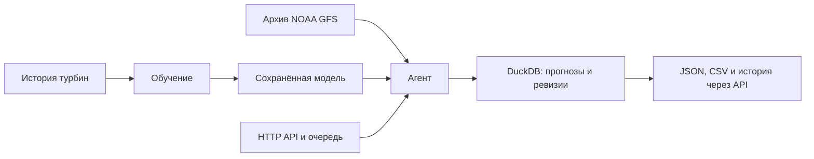

# Windcast — прогноз выработки ВЭС

**Почасовой прогноз мощности двух ветротурбин на 24–48 часов.**
Агент получает погодный прогноз, запускает обученную модель, анализирует результат
и сохраняет историю расчётов. Такой прогноз помогает планировать выработку
и заранее видеть ожидаемые изменения мощности.

Проект команды RentBox для **HackAlem AI**, трек «Энергетика».
Тестовый период по условию задачи — **1–28 февраля 2026 года**.

Модель выдаёт **нормализованную мощность от 0 до 1** — в таком виде выработка
записана в исходных данных: 0 — турбина не вырабатывает, 1 — максимум,
встречающийся в истории. В физические мегаватты это перевести нельзя, пока
организаторы не сообщат номинальную мощность турбин.

[Быстрый старт](#быстрый-старт) · [Что готово](#что-уже-работает) ·
[Результаты](#качество-прогноза) · [Как работает агент](#как-работает-агент) ·
[Проверка](#проверка-основного-сценария) · [Планы](#что-хотели-но-не-успели) ·
[Ограничения](#известные-ограничения)

## Зачем это нужно

Ветростанция заранее заявляет диспетчеру почасовой график выработки и платит за
отклонение от него. Чем точнее прогноз, тем меньше небаланс и тем меньше резервной
мощности приходится держать энергосистеме.

- **Ошибка прогноза вдвое меньше, чем у простого правила.** Средняя абсолютная
  ошибка (MAE) на январе — 0.15947 против 0.34268 у прогноза «будет как в
  последний известный час», то есть на 53,5% ниже. Сравнение выполнено
  на одинаковых прогнозных строках с горизонтами 1–48 часов.
- **Сценарная оценка недовыработки — около 226 МВт·ч в год.** Нулевая мощность
  при ветре 6–12 м/с встречается в 2.2% записей первой турбины и 1.5% второй.
  При условном номинале 2.5 МВт и тарифе 25–30 ₸/кВт·ч оценка составляет
  **5.65–6.78 млн ₸ в год**. Номинал, тариф и причины нулевой мощности требуют
  подтверждения. Разбор — в [бэклоге](docs/BACKLOG.md).
- **Сравнение турбин помогает искать возможные простои.** В июне 2024 доля
  записей с нулевой мощностью при ветре 6–12 м/с составила 22.2% для первой
  турбины и 0.0% для второй; в феврале 2025 — 0.9% и 6.9% соответственно.
  Причины различий нужно сверять с условиями на площадках и журналами эксплуатации.

## Быстрый старт

**Нужны:** Git, Bash, `curl` и запущенный Docker с Compose 2.24+.
Подойдут Linux, macOS или Windows через WSL2. Если Docker нет, скрипт умеет
запускать backend через установленный `uv`. **GPU и API-ключи не нужны.**
Интернет нужен для первого скачивания образов и зависимостей.

```bash
git clone https://github.com/BAITC-Hacks/hack-575875e7-rentbox.git hack-rentbox
cd hack-rentbox
./run.sh demo
```

Эта команда делает всё сама: создаёт `.env`, собирает образ, поднимает API
и рассчитывает прогноз для выпуска **31 января 2026, 18:00 UTC**.
Первый запуск занимает около двух минут — собирается Docker-образ.

**Что получится** — `artifacts/demo-forecast.csv`: почасовой прогноз мощности
на 48 часов вперёд от момента `2026-01-31 18:00 UTC` для каждой из двух турбин.
Это 96 строк — 48 часов × 2 турбины. В терминале результат печатается
в читаемом виде:

```
  Турбина  Местное время (UTC+5)   Через    Мощность
  1        01.02 00:00             +1 ч         2.8%
  1        01.02 01:00             +2 ч         3.0%
  1        01.02 02:00             +3 ч         3.2%

  48 часов × 2 турбины = 96 значений
  Период: 01.02 00:00 — 02.02 23:00 по местному времени
  Мощность от 2.3% до 92.5% нормализованной шкалы, в среднем 29.7%
```

В самом файле — те же значения в машинном виде: время в UTC, мощность
в долях 0…1 (те самые 2.8% — это 0.0276) и технические имена колонок,
чтобы результат читался скриптами без разбора текста.

```csv
turbine_id,valid_time,lead_hour,predicted_power
1,2026-01-31T19:00:00Z,1,0.02757047936320305
1,2026-01-31T20:00:00Z,2,0.029526832699775695
1,2026-01-31T21:00:00Z,3,0.032423589006066324
1,2026-01-31T22:00:00Z,4,0.04179135449230671
```

Пример взят из [первого прогноза текущей модели NOAA](artifacts/gfs-model/first-forecast.csv).
В CSV, выгруженном через API, у каждой строки есть ещё версия модели и происхождение погоды:
какой цикл NOAA использован, когда он был опубликован и SHA-256 погодного CSV.

API с интерактивной документацией: [localhost:8000/docs](http://localhost:8000/docs).
Если выбран другой порт, скрипт напечатает адрес.

### Все команды одним списком

```bash
# Запуск
./run.sh demo          # поднять сервис и рассчитать прогноз на 48 часов
./run.sh all           # backend и дашборд вместе
./run.sh start         # только backend
./run.sh               # меню, выбор пункта цифрой
./run.sh stop          # остановить всё

# Диагностика
./run.sh check         # проверить окружение, ничего не запуская
./run.sh logs          # журнал backend, последние 50 строк
tail -50 .run/web.log  # журнал дашборда

# Настройка
./run.sh setup                     # мастер: пояс, порты, обучение
BACKEND_PORT=9000 ./run.sh demo    # другой порт API
WEB_PORT=3100 ./run.sh all         # другой порт дашборда

# Тесты и проверки
make test              # тесты backend
make lint              # Ruff
npm test               # тесты frontend

# Переобучение (необязательно, готовая модель уже в репозитории)
./scripts/train.sh           # найдёт NVIDIA, иначе CPU
./scripts/train.sh --check   # показать, что будет использовано
./scripts/train.sh --cloud   # инструкция для NVIDIA Brev
```

Всё остальное — подробности ниже: запуск без Docker, работа через API,
обучение по шагам.

### Меню вместо команд

`./run.sh` без аргументов показывает меню — достаточно нажать цифру:

```
  1  Посчитать прогноз          на 48 часов вперёд для двух турбин
  2  Сервис и дашборд           backend + интерфейс в браузере
  3  Только сервис              backend и документация API
  4  Проверить окружение        ничего не запускает
  5  Журнал                     последние 50 строк
  6  Остановить                 все запущенные сервисы
  7  Переобучить модель         найдёт NVIDIA, иначе CPU
  8  Настроить                  пояс, порты, обучение
  0  Выход

Выберите пункт [1]:
```

Enter выбирает первый пункт. В скриптах и CI меню не показывается —
там `./run.sh` просто поднимает backend.

| Команда | Действие |
|---|---|
| `./run.sh demo` | Поднять сервис и рассчитать прогноз |
| `./run.sh all` | Backend и дашборд вместе |
| `./run.sh start` | Только backend |
| `./run.sh check` | Проверить окружение, ничего не запуская |
| `./run.sh logs` | Журнал backend, последние 50 строк |
| `./run.sh stop` | Остановить запущенные сервисы |
| `./run.sh setup` | Мастер настройки: пояс, порты, обучение |
| `BACKEND_PORT=9000 ./run.sh demo` | То же, но на другом порту |

### Настроить вручную (необязательно)

```bash
./run.sh setup
```

Мастер из трёх шагов: часовой пояс исходных данных, порты, обучение.
Enter принимает значение в скобках, `s` пропускает остаток и берёт значения
по умолчанию. Без мастера всё тоже работает — `.env` создаётся автоматически.

> **Настройки времени пока исследовательские:** UTC+5, метка начала
> десятиминутного интервала, ежедневный выпуск в 23:00 по часам CSV.
> Скрипт записывает их в `.env`, только если файла ещё нет.
> Организаторы эти настройки не подтвердили; результаты содержат эту пометку.

### Посмотреть дашборд Windcast

```bash
./run.sh all
```

Дополнительно нужны **Node.js 22.20+ и npm 11**. Скрипт запускает backend
и интерфейс; обычный адрес интерфейса — [localhost:3000](http://localhost:3000).
В дашборде есть график, таблица, история и интерактивная 3D-турбина.

**Дашборд подключён к реальному API.** Выберите дату, турбину и горизонт,
нажмите «Рассчитать прогноз»: интерфейс покажет ход расчёта, результат
и историю из DuckDB. Доступна выгрузка CSV. Порядок работы и настройки —
в [инструкции подключения](docs/frontend-integration.md).

Повторный `./run.sh all` перезапускает дашборд этого проекта и передаёт ему
актуальный порт API. При изменении зависимостей скрипт выполняет `npm ci`
по `package-lock.json`, включая пакет `three` для 3D-сцены.
Если интерфейс не открывается, подробная ошибка находится в `.run/web.log`:

```bash
tail -50 .run/web.log
```

## Что уже работает

| Возможность | Результат / где посмотреть |
|---|---|
| Подготовка предоставленных CSV | Полные часовые средние; [аудит данных](reports/data-audit.md) |
| Загрузка открытых прогнозов по координатам | 730 циклов NOAA GFS с метаданными публикации в `data/gfs-runs/` |
| Обученная модель на 24/48 часов | Ансамбль пяти нейросетей, запускается на CPU; [отчёт](artifacts/gfs-model/report.md) |
| Цикл агента | Получение погоды → подготовка → расчёт → анализ → запись результата |
| Пересчёт и история | Новая ревизия при изменении входов; повторное использование одинаковых входов; DuckDB |
| Воспроизведение февраля | **29 из 29 ежедневных запусков**, 2784 значения; [отчёт выполнения](reports/agent-noaa-replay.json) |
| HTTP API | Очередь, статусы, события, JSON, CSV и запуск последовательности дат; [контракт](docs/API.md) |
| Дашборд | Расчёт через API, реальные статусы, история DuckDB и серверный CSV; браузерная проверка ещё предстоит |
| Помощник сайта | Чат на OpenAI GPT-6 Astra, контекст экрана, источники и кнопки перехода; без ключа — обычная справка |
| NVIDIA API | Необязательные пояснения прогноза и рекомендации по обучению через NIM |

**Готовый прогноз февраля:** [february_replay.csv](artifacts/gfs-model/february_replay.csv).
Каждый выпуск сохраняет полные 48 часов, поэтому последние выпуски захватывают март.
Поле `in_february` выделяет часы целевого месяца.

## Прогноз честный: погода только та, что была доступна

Условие кейса — использовать архивные прогнозы, доступные **на момент решения**,
а не фактическую погоду, ставшую известной позже. Соблазн взять реанализ велик:
он даёт заметно более красивую метрику и нарушает условие.

Этот момент решения обозначается `as_of`. Например, `as_of = 2026-01-31T18:00:00Z`
означает «считаем так, будто сейчас 18:00 UTC 31 января, и ничего более позднего
мы не знаем».

Для каждого использованного погодного файла проверяем историческую доступность:

- источник — операционные циклы **NOAA GFS** из публичного S3, а не реанализ;
- для решения в 18:00 UTC берётся цикл 12:00 UTC того же дня;
- инициализация и горизонт читаются **внутри GRIB**, а дата публикации — из
  S3 `Last-Modified`, и она обязана быть **не позже `as_of`**;
- сохранены URL, ETag, диапазоны байтов и SHA-256 извлечённых GRIB-полей,
  индексов и погодных CSV — **730 циклов** с 01.03.2024 по 28.02.2026 лежат
  в репозитории;
- будущие фактические погода и мощность в признаки не входят; инференс отдельно
  проверяет, что конец обучающей истории не позже `as_of`.

Из 17 трёхчасовых опор одного цикла интерполяцией получаются почасовые значения.

[Исторический протокол](docs/FORECAST_PROTOCOL.md) ·
[Соответствие требованиям кейса](docs/REQUIREMENTS.md)

## Качество прогноза

Измерено по фактической мощности **января 2026**. Чем меньше ошибка, тем лучше.
MAE — средняя абсолютная ошибка; RMSE сильнее учитывает крупные промахи.
Обе метрики выражены в долях нормализованной мощности.

| Модель / горизонт | MAE | RMSE |
|---|---:|---:|
| **Основная модель NOAA, 1–48 ч** | **0.15947** | **0.23190** |
| Та же модель, 1–24 ч | 0.15226 | 0.21898 |
| Та же модель, 25–48 ч | 0.16692 | 0.24453 |
| Базовый прогноз: повтор последнего известного полного часа | 0.34268 | 0.45155 |

**На январе MAE основной модели ниже базового прогноза на 53,5%** — 0.15947
против 0.34268. Сравнение выполнено на одинаковых прогнозных строках
с горизонтами 1–48 часов.

MAE 0.15947 означает среднее абсолютное отклонение 0.15947 по предоставленной
шкале нормализованной мощности 0–1. База нормализации требует подтверждения
организаторов, поэтому перевод ошибки в долю номинальной мощности пока недоступен.
Оценка включает 2928 прогнозных строк; один целевой час может встречаться
в нескольких ежедневных выпусках. На этом периоде ошибка растёт с горизонтом:
0.15226 на сутки вперёд против 0.16692 на вторые.

400 конфигураций обучались на CPU, RTX 5090 и Brev A6000.
Модели выбирались по ноябрю–декабрю 2025. Январь использовался для мониторинга
нескольких экспериментов и не считается новым независимым тестом.
**Качество февраля неизвестно: фактических значений за этот месяц нет.**
Подробности: [метрики модели](artifacts/gfs-model/metrics.json)
и [сравнение с базовыми прогнозами](artifacts/gfs-model/baselines.json).

## Как работает агент

`as_of` — момент, на который воспроизводится решение. Например,
`2026-01-31T18:00:00Z` означает «прогнозируем, располагая только информацией,
доступной к 18:00 UTC 31 января».

1. **Проверяет входы:** координаты, исходные CSV, временные настройки и конец обучения модели.
2. **Получает погоду:** загружает нужный выпуск NOAA GFS или читает сохранённую копию.
3. **Проверяет доступность:** каждый использованный погодный файл должен быть опубликован к `as_of`.
4. **Рассчитывает прогноз:** готовит признаки и выдаёт по 24/48 значений на турбину.
5. **Анализирует результат:** проверяет допустимость мощности и отмечает резкие изменения по часам.
6. **Сохраняет историю:** при изменении входов создаёт ревизию, при совпадении использует прежний результат.

Агент — контроллер инструментов с заданными правилами (`policy`). LLM в этом
цикле не вызывается. Запуски выполняются через очередь API; последовательность
исторических дат задаётся одним запросом. Для повторного получения погоды
есть `refresh_weather=true`; постоянный фоновый опрос источника не включён.



## Запуск без Docker и без собственных ключей

Готовая модель работает на CPU без PyTorch. Для расчёта из сохранённого
архива после установки зависимостей сеть также не нужна.

**Только модель и CSV** — Python 3.12, команды из корня репозитория:

```bash
python3.12 -m venv .venv
. .venv/bin/activate
python -m pip install -r requirements.txt
python -m scripts.predict --as-of 2026-01-31T18:00:00Z --horizon 48
```

Результат — `artifacts/prediction.csv`. Для суток задайте `--horizon 24`.
CLI рассчитывает прогноз; историю и события агента сохраняет backend.

**Полный API** — установленный `uv` и `make`:

```bash
make demo
```

Команда установит зависимости backend и запустит сервер на порту 8000 с теми же
исследовательскими настройками времени, что описаны в быстром старте. Сервер
работает в текущем терминале; остановка — `Ctrl+C`.

## Помощник Windcast на OpenAI ASTRA

На сайте нажмите **«Помощник»**. Он объясняет разделы, выбранный прогноз,
источники погоды и ограничения данных, предлагает переходы и скачивание CSV.
Модель — **`gpt-6-astra`** через OpenAI Responses API.

Добавьте `OPENAI_API_KEY` в существующий серверный `.env` и перезапустите
`./run.sh all`. Ключ в браузер не передаётся. Без ключа или при ошибке API
работает явно обозначенная **«Справка платформы»**; численный прогноз доступен
в обоих режимах. Наличие ключа ещё не подтверждает доступ к модели.

Для точности используются системный промпт, справка по реальным разделам,
данные выпуска из backend и проверка источников и кнопок в JSON-ответе.
[Настройка и устройство помощника](docs/AI-HELP.md),
[системный промпт](backend/app/prompts/helper-system.md).

**NVIDIA NIM подключается отдельно:** `NVIDIA_ENABLED=true` и `NVIDIA_API_KEY`
в `.env`. Он даёт пояснения и рекомендации; обучение модели ВЭС выполняется
на CPU/CUDA/Brev. [Настройка NVIDIA и команды](docs/NVIDIA.md).

## Основной сценарий через API

После запуска откройте [Swagger](http://localhost:8000/docs) или отправьте запрос:

```bash
curl -sS http://localhost:8000/api/agent/runs \
  -H 'Content-Type: application/json' \
  -d '{"as_of":"2026-01-31T18:00:00Z","horizon_hours":48,"turbine_ids":[1,2]}'
```

Ответ содержит `run_id`. По нему доступны:

| Путь | Что возвращает |
|---|---|
| `GET /api/agent/runs/{run_id}` | Статус, прогресс и журнал; дождитесь `completed` |
| `GET /api/agent/runs/{run_id}/forecast` | почасовой прогноз (48 ч × 2 турбины), происхождение погоды и анализ |
| `GET /api/agent/runs/{run_id}/forecast.csv` | Файл CSV |
| `POST /api/agent/replays` | Ежедневные выпуски за заданный период |

Для февраля параметры последовательности: `first_as_of=2026-01-31T18:00:00Z`,
`last_as_of=2026-02-28T18:00:00Z`, `step_hours=24`, `horizon_hours=48`,
`turbine_ids=[1,2]`. [Форматы запросов](docs/API.md) ·
[Пример настоящего ответа NOAA](reports/agent-noaa-first-forecast.json).

## Проверка основного сценария

Команды и ожидаемые результаты. Время первого запуска зависит от скачивания
зависимостей, сборки и доступных ресурсов.

```bash
./run.sh check                     # окружение, данные, кэш погоды
./run.sh demo                      # подготовка окружения, запуск API и расчёт прогноза
```

Ожидаемый результат:

| Шаг | Признак того, что всё в порядке |
|---|---|
| `check` | четыре строки `✓`: Docker или uv, оба CSV, кэш погоды |
| `demo` | `✓ получено 96 почасовых значений → artifacts/demo-forecast.csv` |
| файл | 97 строк: заголовок и 48 часов × 2 турбины |
| метрики | январский MAE в `artifacts/gfs-model/metrics.json` округляется до `0.15947` — того же числа, что в таблице выше |
| воспроизведение февраля | `artifacts/gfs-model/february_replay.csv`, 2784 строки данных без заголовка, 29 ежедневных выпусков |

Тесты и статический анализ:

```bash
make test        # backend
make lint        # Ruff
npm test         # frontend
```

Проверка целостности исходных данных — SHA-256 в
[reports/data-audit.json](reports/data-audit.json) должны совпадать с файлами
в `data/incoming/`; агент сверяет это сам и откажется считать при расхождении.

## Технологии и конфигурация

| Часть проекта | Технологии / зависимости |
|---|---|
| Модель и обработка данных | Python 3.12, NumPy, pandas, scikit-learn; [requirements.txt](requirements.txt) |
| Агент, API, хранение | FastAPI, Pydantic, DuckDB, ecCodes; [pyproject.toml](backend/pyproject.toml), [uv.lock](backend/uv.lock) |
| Дашборд | Next.js 16, React 19, TypeScript, Tailwind, Three.js; [package-lock.json](package-lock.json) |
| Обучение | PyTorch 2.11.0+cu128; GPU используется при обучении MLP |

Backend читает `.env` в корне, затем `backend/.env`; переменные процесса
имеют приоритет. Образец — [.env.example](.env.example).

| Настройка | Назначение |
|---|---|
| `RENTBOX_SOURCE_TIMEZONE` | Часовой пояс CSV; в исследовательском запуске `Etc/GMT-5` |
| `RENTBOX_TIMESTAMP_MEANING` | Смысл метки; в исследовательском запуске `interval_start` |
| `RENTBOX_ALLOW_RESEARCH_TIME_SETTINGS` | `true` разрешает расчёт с явно неподтверждёнными настройками |
| `RENTBOX_TIME_CONFIGURATION_CONFIRMED` | По умолчанию `false`; менять после ответа организаторов |
| `RENTBOX_AGENT_FACTORY` | По умолчанию `src.agent:create_agent` |
| `RENTBOX_MODEL_DIR` | Основная модель — `artifacts/gfs-model`; можно задать другой каталог через окружение процесса |
| `RENTBOX_DATABASE_PATH` | `data/forecasts.duckdb`; в Docker — `/app/state/forecasts.duckdb` в сохраняемом томе |
| `RENTBOX_GFS_CACHE` | Изменяемый кэш: `data/gfs-runtime`; в Docker — `/app/state/gfs`. Задаётся окружением процесса |
| `RENTBOX_CORS_ORIGINS` | JSON-массив разрешённых адресов интерфейса |
| `BACKEND_PORT` / `WEB_PORT` | Порты API / интерфейса: обычно `8000` / `3000` |
| `OPENAI_API_KEY` | Серверный ключ помощника GPT-6 Astra; без него доступна обычная справка |
| `OPENAI_HELPER_ENABLED` | Включение ASTRA, по умолчанию `true`; нужен ключ |
| `OPENAI_BASE_URL` | По умолчанию `https://api.openai.com/v1`, совместимый Responses API |
| `OPENAI_HELPER_REASONING_EFFORT` / `OPENAI_HELPER_TIMEOUT_SECONDS` | По умолчанию `low` / `40`; допустимый таймаут 5–45 секунд |
| `NVIDIA_ENABLED` / `NVIDIA_API_KEY` | Необязательные пояснения NIM; по умолчанию выключены |
| `NVIDIA_BASE_URL` / `NVIDIA_MODEL` / `NVIDIA_TIMEOUT_SECONDS` | Адрес NIM, модель и таймаут; значения в `.env.example` |

При ошибке `CONFIGURATION_REQUIRED` прочитайте её описание: оно указывает
на недостающие настройки времени или несовпадение настроек и координат
с обученной моделью. Исправьте соответствующие значения в существующем `.env`.
Для исследовательского запуска текущей модели используются:

```dotenv
RENTBOX_SOURCE_TIMEZONE=Etc/GMT-5
RENTBOX_TIMESTAMP_MEANING=interval_start
RENTBOX_ALLOW_RESEARCH_TIME_SETTINGS=true
RENTBOX_TIME_CONFIGURATION_CONFIRMED=false
```

После правки перезапустите backend. Если организаторы подтвердят другие
настройки времени или координаты, потребуется пересобрать данные и переобучить модель.

## Что хотели, но не успели

Список проработан и оценён по времени; реализации помешало ограничение в пять
часов. Полный разбор с зависимостями — в [бэклоге](docs/BACKLOG.md).

### Точность прогноза

**Интервал вместо точки.** Диспетчеру нужно не «0.42», а «0.30–0.55 с вероятностью
80%»: решение о закупке балансирующей мощности принимается по нижней границе.
Квантильная регрессия на тех же признаках, три модели вместо одной. Сейчас
прогноз точечный, и это заметно в дашборде — полосы неопределённости рисовать нечем.

**Исключить простои из обучения.** Часы, где ветер 6–12 м/с, а мощность нулевая, —
это остановленная турбина, а не слабый ветер. У первой турбины таких 2.2% записей,
а в июне 2024 было 22% — почти месяц данных, на которых модель учится занижать
прогноз при хорошем ветре. Детектор уже описан, осталось подать флаг в подготовку
выборки.

**Веса погодных моделей.** GFS и ICON скачаны оба, но используется один источник.
Веса, обученные на ноябре–декабре отдельно для каждого горизонта, точнее простого
среднего, а разброс между моделями — бесплатная мера неуверенности: разошлись,
значит интервал шире.

**Самокалибровка дальнего горизонта.** Февральского факта нет, обратной связи по
ошибке тоже. Но агент прогнозирует один и тот же час дважды — с 48 и с 24 часов, —
и систематическое расхождение между ними измеряет смещение дальнего горизонта.
Это позволяет корректировать прогноз, ничего не зная о факте.

### Сценарии, которых ждёт эксплуатация

**Суточный график по регламенту рынка.** ВЭС подаёт диспетчеру почасовой график
на сутки вперёд до жёсткой точки отсечки и отвечает за отклонения от поданного,
а не от последнего своего прогноза. Сейчас расчёт скользящий — это учебная
постановка, регламент производственная.

**Окно для ремонта.** Остановка турбины при 12 м/с стоит номинала, при 3 м/с —
почти ничего. По прогнозу на 48 часов можно найти окно минимальных потерь
и назвать цену остановки.

**Предупреждение о штормовом отключении.** При ветре выше ~25 м/с защита
останавливает турбину: для сети это мгновенный сброс с номинала до нуля,
причём на всей площадке сразу. В истории максимум 22.97 м/с — площадка
к границе подходит, событие реальное.

**Прогноз рампов.** Регулирующий резерв держат не под уровень выработки,
а под скорость её изменения. Падение с 0.8 до 0.2 за час требует поднять
замещающую мощность за этот же час. Агент уже отмечает резкие изменения
в анализе, но отдельной модели и метрики по рампам нет.

**Потребность в резерве.** Из честного интервала прогноза считается, сколько
резервной мощности нужно держать энергосистеме. Это переводит точность модели
в мегаватты и деньги — ценность не для одной станции, а для системы.

### Эксплуатация

**Дообучение на поступающих данных.** Правильная схема здесь не онлайн-обучение,
а champion/challenger: новая модель обучается на накопленном, сравнивается
с рабочей на отложенном окне и заменяет её только если действительно лучше.
Автоматическая подмена модели без проверки в энергетике не применяется —
цена ошибки слишком высока. Инфраструктура готова наполовину: хранилище
уже умеет принимать факт и считать собственную ошибку по горизонтам.

**Мониторинг состояния турбин.** Отношение выработки двух площадок при одинаковом
ветре не зависит от погоды и показывает, какая турбина простаивает. Проверено
на истории: в июне 2024 первая стояла 22.2% времени при нулевом простое второй.
Осталось довести до непрерывного показателя с порогом на алерт — получится
второй продукт помимо прогноза.

### Что сознательно не делали

**LLM в контуре принятия решений.** В названии кейса есть Agentic AI, и соблазн
велик, но детерминированный цикл с проверками выполняет требование полностью,
а языковая модель, решающая, каким будет прогноз, добавляет точку отказа прямо
на демонстрации. LLM для объяснения уже посчитанного — допустимо, для расчёта — нет.

**Нейросети глубже трёхслойного перцептрона.** На 54 тысячах строк табличный
бустинг и небольшой MLP не уступают, а времени съели бы всё. Это подтвердилось
экспериментально: 984 конфигурации в поиске дали менее процента прироста, и стало
ясно, что узкое место не в архитектуре модели, а в качестве погодного прогноза.

## Известные ограничения

- Временные настройки исходных CSV ещё требуют подтверждения организаторов.
- Факта февраля и номинальной мощности турбин нет: метрики февраля
  и результаты в МВт/МВт·ч неизвестны. Модель выдаёт точечный прогноз;
  вероятностные интервалы пока не рассчитываются.
- Текущий сценарий NOAA рассчитан на ежедневный выпуск в 18:00 UTC.
  Погодная сетка 0.25° и интерполяция трёхчасовых опор ограничивают детализацию.
- Дашборд показывает реальные прогнозы и доступные погодные значения из входов
  модели. В старых сохранённых выпусках погода может отсутствовать. Факт февраля,
  ошибки по нему и интервалы неопределённости не рассчитываются.
- Ответы ASTRA требуют серверного ключа с доступом к модели. Промпт и проверка
  схемы снижают риск выдуманных сведений, но не гарантируют безошибочность текста.
- Подключение дашборда проверено статическим анализом; сценарий в браузере
  с расчётом, историей и скачиванием CSV ещё нужно пройти.
- DuckDB рассчитан на один процесс-писатель; backend запускается с одним worker.
- Основной сценарий NOAA выполнен через локальный API: 29/29 запусков.
  Чистый запуск backend через Docker после подключения NOAA проверен Claude Code;
  результат — 96 почасовых значений, запись есть в [CHANGELOG](CHANGELOG.md).
- **Публичный деплой:** пока отсутствует. **Видео демо:** пока отсутствует.

## Где лежат данные, модель и документация

| Путь | Содержимое |
|---|---|
| `data/incoming/` | Два исходных CSV организаторов, история до 31 января 2026 |
| `data/gfs-runs/` | 730 погодных циклов с 1 марта 2024 по 28 февраля 2026 и их происхождение |
| `artifacts/gfs-model/` | Веса, январские метрики и прогнозы февраля |
| `artifacts/gfs-search/` | Протокол и результаты выбора 400 конфигураций |
| `src/agent.py`, `src/gfs_model.py` | Контроллер и расчёт мощности |
| `backend/app/`, `src/storage.py` | HTTP API и история прогнозов |
| `apps/web/`, `packages/ui/` | Интерфейс Windcast |

Дополнительно: [ТЗ и критерии](docs/hackathon/track-energy.md),
[план команды](docs/PLAN.md), [бэклог](docs/BACKLOG.md),
[backend](backend/README.md), [frontend](docs/FRONTEND.md),
[подключение интерфейса](docs/frontend-integration.md).

<details>
<summary><strong>Повторное обучение и команды разработчика</strong></summary>

Для повторного обучения нужны зависимости backend; для GPU — PyTorch с CUDA.
Для готового прогноза обучение не требуется. Все команды — из корня проекта:

Одной командой — скрипт сам найдёт NVIDIA и выберет устройство:

```bash
./scripts/train.sh            # GPU, если доступна; иначе CPU
./scripts/train.sh --cpu      # принудительно CPU
./scripts/train.sh --gpu      # требовать рабочую CUDA
./scripts/train.sh --check    # только показать, что будет использовано
./scripts/train.sh --cloud    # инструкция по запуску на NVIDIA Brev
```

Своё окружение с PyTorch: `PYTHON=/path/to/python ./scripts/train.sh`.
Инференс от PyTorch не зависит — обученная модель хранится как NumPy-веса.
Результаты идут в отдельный каталог `artifacts/retraining/`; текущая конкурсная
модель сохраняется. Свой каталог задаётся `--output DIR`.

Пошагово, если нужен контроль над каждым этапом:

```bash
# Сохранённые циклы уже в git; загрузка недостающих требует сети и ecCodes.
python -m scripts.fetch_gfs_runs --start 2024-03-01 --end 2026-02-28
python -m scripts.train_gfs prepare
python -m scripts.train_gfs train --worker cpu
python -m scripts.train_gfs train --worker local-gpu
python -m scripts.train_gfs train --worker cloud-gpu
python -m scripts.train_gfs finalize
```

Имена GPU-workers обозначают разные наборы конфигураций, а не удалённый запуск.
Команды можно выполнить на одной GPU-машине. При работе на двух машинах перед
`finalize` объедините каталоги workers в `artifacts/gfs-search/`.
Протокол, периоды выбора и ограничения оценки — в [отчёте модели](artifacts/gfs-model/report.md).

Предыдущие эксперименты: `artifacts/ensemble/` и `artifacts/expanded/`.
`artifacts/power_curve/` — диагностика по фактическому ветру; её ошибку нельзя
использовать как качество прогноза на сутки.

Команды разработчика: `make dev`, `make openapi`, `make lint`, `make test`;
для frontend — `npm run build`, `npm run lint`, `npm run typecheck`, `npm test`.

</details>

## Внешние материалы

<details>
<summary>Источники данных, библиотеки и лицензии</summary>

| Материал | Источник | Лицензия / условия |
|---|---|---|
| CSV двух турбин | Организаторы, ссылки в `reports/data-audit.md` | Предоставлены для кейса; отдельная открытая лицензия не указана |
| Операционные прогнозы NOAA GFS | [NOAA GFS в AWS](https://registry.opendata.aws/noaa-gfs-bdp-pds/) | Открытые данные NOAA; использовать с указанием источника. Сохранены точки, метаданные и хэши GRIB-полей |
| Архивные прогнозы GFS / ICON | [Open-Meteo](https://open-meteo.com/en/docs/previous-runs-api), NOAA / DWD | [CC BY 4.0](https://open-meteo.com/en/licence); исходные ответы сохранены, признаки преобразованы нами |
| ecCodes, чтение GRIB | [ECMWF ecCodes](https://github.com/ecmwf/eccodes-python) | Apache-2.0 |
| Python | [python.org](https://www.python.org/) | PSF |
| FastAPI | [fastapi.tiangolo.com](https://fastapi.tiangolo.com/) | MIT |
| Pydantic / settings | [docs.pydantic.dev](https://docs.pydantic.dev/) | MIT |
| NumPy, pandas, scikit-learn | [NumPy](https://numpy.org/), [pandas](https://pandas.pydata.org/), [scikit-learn](https://scikit-learn.org/) | BSD-3-Clause |
| Joblib, threadpoolctl | [Joblib](https://joblib.readthedocs.io/), [threadpoolctl](https://github.com/joblib/threadpoolctl) | BSD-3-Clause |
| HTTPX / Uvicorn | [python-httpx.org](https://www.python-httpx.org/), [uvicorn.org](https://www.uvicorn.org/) | BSD-3-Clause |
| DuckDB | [duckdb.org](https://duckdb.org/) | MIT |
| PyArrow | [Apache Arrow](https://arrow.apache.org/) | Apache-2.0 |
| PyTorch, только обучение | [PyTorch](https://pytorch.org/) | BSD-3-Clause |
| OpenAI GPT-6 Astra, помощник сайта | [Модель и API](https://developers.openai.com/api/docs/models/gpt-6-astra) | Облачный сервис OpenAI API; ключ владельца развёртывания, режим справки без ключа |
| NVIDIA Nemotron, необязательные пояснения NIM | [Модель и API](https://docs.api.nvidia.com/nim/reference/nvidia-llama-3_3-nemotron-super-49b-v1_5) | NVIDIA Open Model License и Llama 3.3 Community License; hosted API — условия NVIDIA API |
| CatBoost, дополнительное обучение на Brev | [CatBoost](https://github.com/catboost/catboost) | Apache-2.0; в обязательные зависимости инференса не входит |
| uv | [docs.astral.sh](https://docs.astral.sh/uv/) | MIT / Apache-2.0 |
| ESLint / Prettier | [ESLint](https://eslint.org/), [Prettier](https://prettier.io/) | MIT |
| pytest / Ruff | [pytest.org](https://docs.pytest.org/), [docs.astral.sh/ruff](https://docs.astral.sh/ruff/) | MIT |
| Three.js, просмотр 3D-турбины | [Three.js](https://threejs.org/) | MIT; версия и лицензия закреплены в package-lock.json |
| next (frontend) | [npm](https://www.npmjs.com/package/next) | MIT |
| react (frontend) | [npm](https://www.npmjs.com/package/react) | MIT |
| shadcn (frontend) | [npm](https://www.npmjs.com/package/shadcn) | MIT |
| @base-ui/react (frontend) | [npm](https://www.npmjs.com/package/@base-ui/react) | MIT |
| tailwindcss (frontend) | [npm](https://www.npmjs.com/package/tailwindcss) | MIT |
| typescript (frontend) | [npm](https://www.npmjs.com/package/typescript) | Apache-2.0 |
| turbo (frontend) | [npm](https://www.npmjs.com/package/turbo) | MIT |
| lucide-react (frontend) | [npm](https://www.npmjs.com/package/lucide-react) | ISC |
| next-themes (frontend) | [npm](https://www.npmjs.com/package/next-themes) | MIT |
| tw-animate-css (frontend) | [npm](https://www.npmjs.com/package/tw-animate-css) | MIT |
| class-variance-authority (frontend) | [npm](https://www.npmjs.com/package/class-variance-authority) | Apache-2.0 |
| zod (frontend) | [npm](https://www.npmjs.com/package/zod) | MIT |
| cn (frontend) | [npm](https://www.npmjs.com/package/cn) | MIT |

Погодные данные: [Weather data by Open-Meteo.com](https://open-meteo.com/).
Транзитивные зависимости backend закреплены в uv.lock.

3D-турбина создана командой в Blender; исходная сцена и генератор включены
в репозиторий. Blender и MCP использовались при создании сцены и не требуются
для запуска. Источники и ограничения иллюстрации — в [документации frontend](docs/FRONTEND.md).

</details>

## Заранее подготовленные компоненты

До реализации подготовлены организационная документация, служебные скрипты
и локальное Python/CUDA-окружение. Погодный модуль, модель, агент, backend
и интерфейс разрабатываются под кейс в этом репозитории 23.09.2026.
Для интерфейса использованы Next.js и компоненты shadcn/ui (Vega, Base UI).

## Вклад участников

Каждый участник вёл свою часть и коммитил под собственной учётной записью.
Распределение ниже можно сверить с историей репозитория:

```bash
git shortlog -sn HEAD
git log --author='Romario' --name-only --format=''
```

Первая команда показывает число коммитов по авторам, вторая — изменённые файлы
выбранного автора. Замените `Romario` на нужное имя, сохранив кавычки.

| Участник | Учётная запись | Зона ответственности | Основные каталоги |
|---|---|---|---|
| **Поляков Александр Викторович** (капитан) | `flyperry` | Данные и аудит, погодный модуль NOAA, обучение и отбор моделей, агент, хранилище прогнозов, запуск и документация | `src/`, `scripts/`, `artifacts/`, `data/`, `reports/` |
| **Устименко Роман Викторович** | `Romario` | HTTP API: маршруты, схемы, сервисы, очередь запусков, контракт и OpenAPI | `backend/app/`, `docs/API.md` |
| **Ныгметов Нурсултан Жолдыбаевич** | `Carcadju` | Дашборд Windcast: интерфейс, библиотека компонентов, 3D-визуализация турбины | `apps/web/`, `packages/ui/` |

## AI-инструменты

Использование AI-инструментов разрешено условиями хакатона; ниже — что именно
они делали. Весь код проверялся участниками перед коммитом.

| Инструмент | Что делал |
|---|---|
| **OpenAI Codex** | Подготовка данных, погодный модуль, обучение модели, агент, backend, контракт API, документация |
| **Claude Code** | Хранилище прогнозов на DuckDB, аудит исходных данных, расширенный поиск моделей на RTX 5090, скрипт запуска `run.sh`, материалы для интеграции фронта |
| **Blender MCP** | Создание 3D-сцены турбины для дашборда; для запуска проекта не требуется |

Следы работы инструментов сохранены в истории коммитов и в [CHANGELOG.md](CHANGELOG.md),
где каждая запись указывает, кто и что добавил.
