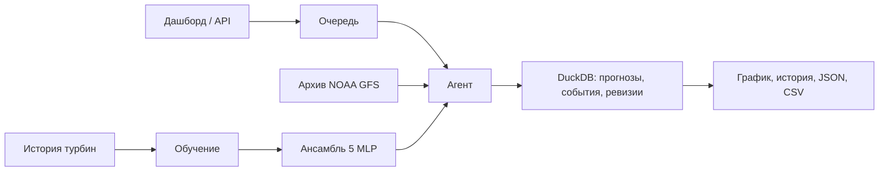

# Windcast — прогноз выработки ВЭС

**Русский** · [English](README.en.md) · [Қазақша](README.kk.md)

**Почасовой прогноз нормализованной мощности двух ветротурбин на 24–48 часов.**
Агент получает архивный прогноз погоды, запускает обученную модель, анализирует
результат и сохраняет расчёт в историю. Интерфейс показывает график, погоду,
этапы работы агента и позволяет скачать CSV.

Проект команды **RentBox** для HackAlem AI, трек «Энергетика».
Конкурсный период прогнозирования — **1–28 февраля 2026 года**.

[Запуск](#быстрый-старт) · [Проверка](#проверка-основного-сценария) ·
[Результаты](#качество-прогноза) · [Архитектура](#как-устроено-решение) ·
[Ограничения](#известные-ограничения) · [Источники](#внешние-материалы)

## Для чего нужен и в чём преимущества

**Пользователь — диспетчер или аналитик ветроэлектростанции.** Ему нужно заранее
оценивать ожидаемую выработку, замечать резкие изменения мощности и сравнивать
выпуски прогноза перед планированием работы станции.

- **Прогноз на двое суток:** почасовой график по каждой турбине и выгрузка для
  дальнейших расчётов; агент отмечает резкие изменения ожидаемой мощности.
- **Проверяемые источники:** у расчёта сохраняются версия модели, погодный выпуск,
  время доступности и хэши данных. Можно проследить, на чём основан результат.
- **Воспроизведение прошлого:** система последовательно рассчитывает февраль,
  используя только погодные прогнозы, доступные на момент каждого решения.
- **Запуск без специального оборудования:** готовая модель работает на CPU;
  основной сценарий не требует GPU, личных аккаунтов или API-ключей.

На январском периоде мониторинга MAE модели на **53,5% ниже**, чем у прогноза
«повторить последний известный час». Это результат исторического эксперимента;
экономический эффект в эксплуатации ещё не измерялся.

## Быстрый старт

**Для сайта нужны:** Git, Bash, `curl`, запущенный Docker с Compose 2.24+,
Node.js 22.20+ и npm 11. Поддерживаются Linux, macOS и Windows через WSL2.
Интернет нужен для первоначальной загрузки образов и зависимостей.

```bash
git clone https://github.com/BAITC-Hacks/hack-575875e7-rentbox.git hack-rentbox
cd hack-rentbox
./run.sh all
```

Скрипт создаёт `.env`, если его нет, запускает backend и дашборд.
Обычно сайт доступен на **http://localhost:3000**, документация API —
на **http://localhost:8000/docs**. **Используйте адреса, напечатанные скриптом:**
при занятом порте он выбирает свободный. Продолжительность первого запуска
зависит от загрузки зависимостей и сборки.

**Проверить только расчёт, без Node.js и браузера:**

```bash
./run.sh demo
```

Ожидаемый результат — `artifacts/demo-forecast.csv`: **96 строк данных**
(48 часов × 2 турбины) и заголовок. Момент решения — 31 января 2026, 18:00 UTC;
прогноз покрывает 1–2 февраля по принятому в эксперименте UTC+5.

> Временные настройки пока исследовательские: UTC+5, метка начала
> десятиминутного интервала, ежедневный выпуск в 23:00 местного времени.
> Они явно помечены как неподтверждённые. Существующий `.env` сохраняется.

### Команды запуска и диагностики

| Команда | Что делает |
|---|---|
| `./run.sh` | Интерактивное меню; без терминала — запуск backend |
| `./run.sh start` | Только backend |
| `./run.sh web` | Перезапуск дашборда с адресом уже работающего backend |
| `./run.sh check` | Проверка окружения и наличия данных |
| `./run.sh logs` | Последние строки журнала backend |
| `tail -50 .run/web.log` | Журнал дашборда |
| `./run.sh stop` | Остановка сервисов проекта |
| `./run.sh setup` | Настройка времени, портов и обучения |
| `./run.sh settings` | Подключение OpenAI: аккаунт ChatGPT / API key |

Для других портов: `BACKEND_PORT=9000 WEB_PORT=3100 ./run.sh all`.
Если сайт пишет «Сервер недоступен» после смены порта API, выполните
`./run.sh web`; если backend остановлен — `./run.sh all`.

### Без Docker

Установите Python 3.12 и `uv`; для сайта также нужны Node.js и npm.
Если рабочий Docker отсутствует, тот же скрипт выберет локальный запуск:

```bash
./run.sh all
```

Он подготовит окружение backend по `backend/uv.lock` при первом запуске
и передаст дашборду фактический порт API. Для одного расчёта используйте
`./run.sh demo`.

## Проверка основного сценария

**Без собственных ключей:** достаточно быстрого старта. Модель, исходные CSV
и сохранённые погодные выпуски входят в репозиторий. Расчёт выполняется
настоящей моделью; необязательные языковые помощники на него не влияют.

1. Откройте сайт по адресу из терминала, раздел **«Прогноз выработки»**.
2. Выберите **1 февраля 2026**, **48 часов** и обе турбины; нажмите
   **«Рассчитать прогноз»**.
3. Дождитесь завершения в разделе **«AI-агент»**: доступны этапы и сообщения.
4. Посмотрите график и таблицу, скачайте **CSV**. В нём должны быть 96 строк
   данных, мощность в шкале 0–1 и сведения о происхождении погоды.
5. Откройте **«История запусков»**, обновите страницу и выберите сохранённый выпуск.
   Готовые расчёты хранятся в DuckDB и сохраняются после перезапуска backend.

**Единицы:** исходные значения мощности лежат в диапазоне 0–1; интерфейс
показывает их как 0–100% этой шкалы. Формула нормализации не предоставлена.
Для перевода в МВт/МВт·ч нужны её параметры и характеристики турбин.

**Режим «Симуляция» — отдельный учебный сценарий.** Погода, состояния турбины
и мощность в нём синтетические; МВт рассчитываются из заданного пользователем
условного номинала. Симуляция не использует NOAA или обученную модель,
не сохраняется в историю API и не является результатом конкурсного прогноза.

### Воспроизвести весь февраль

После `./run.sh all` можно использовать прокси сайта. Если сайт запущен
на другом порту, замените `3000`:

```bash
curl --fail-with-body -sS http://localhost:3000/api/agent/replays \
  -H 'Content-Type: application/json' \
  -d '{"first_as_of":"2026-01-31T18:00:00Z","last_as_of":"2026-02-28T18:00:00Z","step_hours":24,"horizon_hours":48,"turbine_ids":[1,2]}'
```

Ответ содержит `replay_id`. Прогресс — `GET /api/agent/replays/{replay_id}`;
дочерние `run_ids` дают доступ к статусу, прогнозу и CSV каждого выпуска.
Ожидается **29 завершённых выпусков**, по 96 значений в каждом.
Последние полные горизонты захватывают март.

Уже рассчитанные результаты: [2784 прогнозных строки](artifacts/gfs-model/february_replay.csv)
(поле `in_february` выделяет целевой месяц),
[отчёт агента: 29/29 без ошибок](reports/agent-noaa-replay.json).
Форматы всех запросов — в [контракте API](docs/API.md).

## Как устроено решение



**Агент — контроллер инструментов с заданными правилами (`policy`).** После
запроса он проверяет входы, получает погоду по координатам, готовит признаки,
запускает модель, проверяет результат и сохраняет историю. Численный прогноз
рассчитывает ансамбль; Astra помогает пользователю ориентироваться на сайте.

Повторный запрос с `refresh_weather=true` запрашивает обновление погоды. При изменении
входов создаётся новая ревизия, при совпадении используется сохранённый результат.
**Постоянный фоновый опрос погоды не включён:** обновление запускается запросом
API. Последовательность исторических дат выполняется через replay.

### Соблюдение исторической доступности погоды

`as_of` — момент, на который воспроизводится решение. Для каждого выпуска
в 18:00 UTC используется операционный цикл NOAA GFS 12:00 UTC того же дня.

- Инициализация и горизонт проверяются внутри GRIB; публикация исходного объекта
  S3 (`Last-Modified`) должна быть не позже `as_of`.
- Сохраняются URL, метаданные публикации и SHA-256 погодных данных.
  В репозитории — 730 циклов с 1 марта 2024 по 28 февраля 2026.
- Почасовая погода интерполируется из 17 трёхчасовых опор прогноза.
- Будущие фактические погода и мощность не входят в признаки; конец истории
  обучения модели проверяется относительно `as_of`.

Подробности: [протокол прогнозирования](docs/FORECAST_PROTOCOL.md),
[соответствие ТЗ](docs/REQUIREMENTS.md), [аудит данных](reports/data-audit.md).

## Качество прогноза

**Январь 2026 — период мониторинга экспериментов, не новый независимый тест.**
MAE — средняя абсолютная ошибка, RMSE сильнее учитывает крупные ошибки.
Обе метрики выражены в долях нормализованной мощности; меньше — лучше.

| Модель / горизонт | MAE | RMSE |
|---|---:|---:|
| **Ансамбль NOAA, 1–48 ч** | **0.15947** | **0.23190** |
| Тот же ансамбль, 1–24 ч | 0.15226 | 0.21898 |
| Тот же ансамбль, 25–48 ч | 0.16692 | 0.24453 |
| Повтор последнего известного полного часа, 1–48 ч | 0.34268 | 0.45155 |

Сравнение выполнено на одинаковых 2928 прогнозных строках; один целевой час
может встречаться в нескольких выпусках. Снижение MAE относительно базового
прогноза — 53,5%. Основной поиск включал 400 конфигураций на CPU, RTX 5090
и Brev A6000; отбор выполнен по ноябрю–декабрю 2025.

**Точность за февраль неизвестна: фактическая мощность за этот месяц не дана.**
[Метрики](artifacts/gfs-model/metrics.json) ·
[Базовые прогнозы](artifacts/gfs-model/baselines.json) ·
[Отчёт об обучении](artifacts/gfs-model/report.md).

## Технологии и настройки

| Часть | Стек и зафиксированные зависимости |
|---|---|
| Данные и модель | Python 3.12, NumPy, pandas, scikit-learn; [requirements.txt](requirements.txt) |
| Агент и API | FastAPI, Pydantic, DuckDB, ecCodes; [pyproject.toml](backend/pyproject.toml), [uv.lock](backend/uv.lock) |
| Интерфейс | Next.js 16, React 19, TypeScript, Tailwind, Three.js; [package-lock.json](package-lock.json) |
| Обучение | PyTorch с CUDA, локальная GPU и NVIDIA Brev; готовый прогноз работает без PyTorch |

Backend читает `.env`, затем `backend/.env`; переменные процесса имеют
приоритет. Полный пример — [.env.example](.env.example). Ключи остаются на сервере.

| Параметры | Назначение / значение |
|---|---|
| `RENTBOX_SOURCE_TIMEZONE` / `RENTBOX_TIMESTAMP_MEANING` | Для поставляемой модели: `Etc/GMT-5` / `interval_start` |
| `RENTBOX_ALLOW_RESEARCH_TIME_SETTINGS` / `RENTBOX_TIME_CONFIGURATION_CONFIRMED` | Быстрый старт: `true` / `false`; подтверждение менять только после ответа организаторов |
| `BACKEND_PORT` / `WEB_PORT` | Порты запуска; обычно `8000` / `3000`, задаются перед командой `run.sh` |
| `RENTBOX_DATABASE_PATH` | Локально `data/forecasts.duckdb`; Docker использует сохраняемый том `/app/state` |
| `RENTBOX_AGENT_FACTORY` | `src.agent:create_agent` |
| `RENTBOX_MODEL_DIR` / `RENTBOX_GFS_CACHE` | Модель / изменяемый кэш; задаются окружением процесса, подробнее в [инструкции агента](docs/backend/agent-integration.md) |
| `RENTBOX_CORS_ORIGINS` | JSON-массив разрешённых адресов интерфейса |
| `OPENAI_HELPER_AUTH_MODE` / `OPENAI_API_KEY` | Способ подключения Astra / серверный API-ключ |
| `OPENAI_HELPER_ENABLED` | Включение Astra; без доступного подключения работает обычная справка |
| `NVIDIA_ENABLED` / `NVIDIA_API_KEY` | Необязательные пояснения NVIDIA NIM; по умолчанию отключены |

При `CONFIGURATION_REQUIRED` прочитайте сообщение API и проверьте временные
настройки в существующем `.env`. При изменении подтверждённого часового пояса
или координат потребуется пересобрать данные и переобучить модель.

### Помощник сайта и NVIDIA

**Astra:** откройте «Помощник» на сайте. Модель `gpt-6-astra` получает справку
и контекст выбранного выпуска; системный промпт ограничивает ответы известными
сведениями, сервер проверяет источники и кнопки перехода.

Подключение — `./run.sh settings`: **API key** для сервера или **аккаунт ChatGPT**
через установленный Codex CLI для локальной проверки. В последнем режиме
backend запускается на компьютере, история проверки хранится отдельно в
`.run/chatgpt/forecasts.duckdb`; токены входа Codex в проект не копируются.
Модель в обоих случаях работает в облаке OpenAI. Применение настроек — `./run.sh all`.
Без подключения и при ошибке доступна явно обозначенная справка платформы.

**NVIDIA NIM:** необязательные пояснения и рекомендации. Обучение модели ВЭС
выполняется на CPU/CUDA/Brev отдельной командой `./scripts/train.sh`;
результаты сохраняются в `artifacts/retraining/`, отдельно от поставляемой модели.
[Настройки Astra](docs/AI-HELP.md) · [Системный промпт](backend/app/prompts/helper-system.md) ·
[NVIDIA и обучение](docs/NVIDIA.md).

## Известные ограничения

- Часовой пояс и смысл меток измерений требуют подтверждения; результаты исследовательские.
- Нет февральского факта, параметров нормализации и подтверждённого номинала турбин.
  Вероятностные интервалы и денежная оценка эффекта не рассчитываются.
- NOAA-сценарий рассчитан на ежедневный выпуск в 18:00 UTC;
  сетка 0.25° и интерполяция ограничивают детализацию погоды.
- Нет фонового обновления погоды и автоматического дообучения по датчикам.
- 3D-сцена иллюстративная: вращение не измеряет обороты, лёд не является диагнозом.
  В старых сохранённых выпусках могут отсутствовать погодные значения для отображения.
- DuckDB используется с одним процессом-писателем; backend — с одним worker.
- Проверка схемы ответа Astra не гарантирует фактическую безошибочность текста.
- **Развёрнутая публичная версия и видео:** пока отсутствуют; проверка — локально.

**Дальнейшее развитие:** фоновые обновления, приём измерений с датчиков,
проверяемое переобучение на новых данных, интервалы неопределённости и планирование
окон обслуживания. Диагностика простоев требует эксплуатационных статусов;
расхождение двух прогнозов само по себе не измеряет ошибку. [Бэклог](docs/BACKLOG.md).

## Проверки и структура репозитория

Проверен запрос через прокси дашборда к реальному backend: расчёт 48 часов
для двух турбин завершился, CSV содержит 96 строк. Сохранён отчёт полного
февральского replay. Это не заменяет проверку итогового коммита из чистого клона.

```bash
make test                 # тесты backend (нужен uv)
make lint                 # статический анализ backend
npm test                  # тесты frontend
npm run typecheck         # TypeScript
./scripts/check-clean-env.sh  # чистый клон: сборка Docker и health
```

Последний скрипт проверяет запуск контейнера; работу интерфейса и расчёт проверяют
шаги раздела «Проверка основного сценария».

| Каталог | Содержимое |
|---|---|
| `data/incoming/`, `data/gfs-runs/` | Исходные CSV и архив прогнозов погоды |
| `artifacts/gfs-model/`, `artifacts/gfs-search/` | Модель, метрики, прогнозы и результаты отбора |
| `src/`, `backend/app/` | Агент, расчёт, API и хранение |
| `apps/web/`, `packages/ui/` | Интерфейс и компоненты |
| `reports/`, `docs/` | Аудит, отчёты, ТЗ и инструкции |

[ТЗ и критерии](docs/hackathon/track-energy.md) · [API](docs/API.md) ·
[Подключение фронта](docs/frontend-integration.md) · [Журнал изменений](CHANGELOG.md).

## Внешние материалы

<details>
<summary>Источники данных, библиотеки и лицензии</summary>

| Материал | Источник | Лицензия / условия |
|---|---|---|
| CSV двух турбин | Организаторы, ссылки в `reports/data-audit.md` | Предоставлены для кейса; отдельная открытая лицензия не указана |
| Операционные прогнозы NOAA GFS | [NOAA GFS в AWS](https://registry.opendata.aws/noaa-gfs-bdp-pds/) | Открытые данные NOAA; использовать с указанием источника. Сохранены точки, метаданные и хэши GRIB-полей |
| Архивные прогнозы GFS / ICON | [Open-Meteo](https://open-meteo.com/en/docs/previous-runs-api), NOAA / DWD | [CC BY 4.0](https://open-meteo.com/en/licence); исходные ответы сохранены, признаки преобразованы нами |
| ecCodes, чтение GRIB | [ECMWF ecCodes](https://github.com/ecmwf/eccodes-python) | Apache-2.0 |
| Python | [python.org](https://www.python.org/) | PSF |
| FastAPI | [fastapi.tiangolo.com](https://fastapi.tiangolo.com/) | MIT |
| Pydantic / settings | [docs.pydantic.dev](https://docs.pydantic.dev/) | MIT |
| NumPy, pandas, scikit-learn | [NumPy](https://numpy.org/), [pandas](https://pandas.pydata.org/), [scikit-learn](https://scikit-learn.org/) | BSD-3-Clause |
| Joblib, threadpoolctl | [Joblib](https://joblib.readthedocs.io/), [threadpoolctl](https://github.com/joblib/threadpoolctl) | BSD-3-Clause |
| HTTPX / Uvicorn | [python-httpx.org](https://www.python-httpx.org/), [uvicorn.org](https://www.uvicorn.org/) | BSD-3-Clause |
| DuckDB | [duckdb.org](https://duckdb.org/) | MIT |
| PyArrow | [Apache Arrow](https://arrow.apache.org/) | Apache-2.0 |
| PyTorch, только обучение | [PyTorch](https://pytorch.org/) | BSD-3-Clause |
| OpenAI GPT-6 Astra, помощник сайта | [Модель и API](https://developers.openai.com/api/docs/models/gpt-6-astra) | Облачный сервис OpenAI; серверный API-ключ или локальный вход Codex через ChatGPT, обычная справка без подключения |
| NVIDIA Nemotron, необязательные пояснения NIM | [Модель и API](https://docs.api.nvidia.com/nim/reference/nvidia-llama-3_3-nemotron-super-49b-v1_5) | NVIDIA Open Model License и Llama 3.3 Community License; hosted API — условия NVIDIA API |
| CatBoost, дополнительное обучение на Brev | [CatBoost](https://github.com/catboost/catboost) | Apache-2.0; в обязательные зависимости инференса не входит |
| uv | [docs.astral.sh](https://docs.astral.sh/uv/) | MIT / Apache-2.0 |
| ESLint / Prettier | [ESLint](https://eslint.org/), [Prettier](https://prettier.io/) | MIT |
| pytest / Ruff | [pytest.org](https://docs.pytest.org/), [docs.astral.sh/ruff](https://docs.astral.sh/ruff/) | MIT |
| Three.js, просмотр 3D-турбины | [Three.js](https://threejs.org/) | MIT; версия и лицензия закреплены в package-lock.json |
| next (frontend) | [npm](https://www.npmjs.com/package/next) | MIT |
| react (frontend) | [npm](https://www.npmjs.com/package/react) | MIT |
| shadcn (frontend) | [npm](https://www.npmjs.com/package/shadcn) | MIT |
| @base-ui/react (frontend) | [npm](https://www.npmjs.com/package/@base-ui/react) | MIT |
| tailwindcss (frontend) | [npm](https://www.npmjs.com/package/tailwindcss) | MIT |
| typescript (frontend) | [npm](https://www.npmjs.com/package/typescript) | Apache-2.0 |
| turbo (frontend) | [npm](https://www.npmjs.com/package/turbo) | MIT |
| lucide-react (frontend) | [npm](https://www.npmjs.com/package/lucide-react) | ISC |
| next-themes (frontend) | [npm](https://www.npmjs.com/package/next-themes) | MIT |
| tw-animate-css (frontend) | [npm](https://www.npmjs.com/package/tw-animate-css) | MIT |
| class-variance-authority (frontend) | [npm](https://www.npmjs.com/package/class-variance-authority) | Apache-2.0 |
| zod (frontend) | [npm](https://www.npmjs.com/package/zod) | MIT |
| cn (frontend) | [npm](https://www.npmjs.com/package/cn) | MIT |

Погодные данные: [Weather data by Open-Meteo.com](https://open-meteo.com/).
Транзитивные зависимости backend закреплены в uv.lock.

3D-турбина создана командой в Blender; исходная сцена и генератор включены
в репозиторий. Blender и MCP использовались при создании сцены и не требуются
для запуска. Источники и ограничения иллюстрации — в [документации frontend](docs/FRONTEND.md).

</details>

## Заранее подготовленные компоненты

До хакатона подготовлены организационные материалы, служебные скрипты и локальное
Python/CUDA-окружение. Модель, погодный модуль, агент, API и интерфейс для этого
кейса разрабатывались в репозитории 23.09.2026. Для интерфейса использованы
Next.js и компоненты shadcn/ui (Vega, Base UI); внешние материалы указаны выше.

## Команда и AI-инструменты

| Участник | Учётная запись | Зона ответственности | Основные каталоги |
|---|---|---|---|
| **Поляков Александр Викторович** (капитан) | `flyperry` | Данные и аудит, погодный модуль NOAA, обучение и отбор моделей, агент, хранилище прогнозов, запуск и документация | `src/`, `scripts/`, `artifacts/`, `data/`, `reports/` |
| **Устименко Роман Викторович** | `Romario` | HTTP API: маршруты, схемы, сервисы, очередь запусков, контракт и OpenAPI | `backend/app/`, `docs/API.md` |
| **Ныгметов Нурсултан Жолдыбаевич** | `Carcadju` | Дашборд Windcast: интерфейс, библиотека компонентов, 3D-визуализация турбины | `apps/web/`, `packages/ui/` |

Использовались **OpenAI Codex** (данные, модель, агент, API, интеграция, документация),
**Claude Code** (DuckDB, аудит, обучение, запуск и интеграция) и **Blender MCP**
(создание 3D-сцены). Результаты работы и вклад участников отражены в истории
коммитов и [CHANGELOG.md](CHANGELOG.md); авторов можно посмотреть через
`git shortlog -sn HEAD`.
