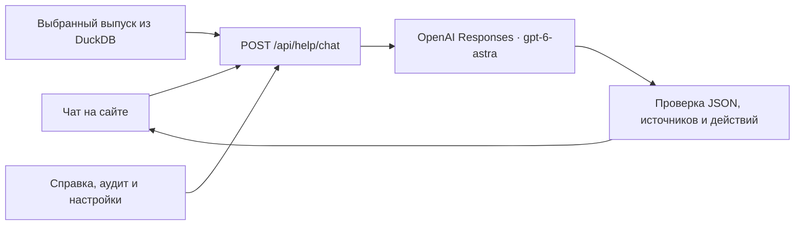

# Помощник Windcast

**Windcast — проект, RentBox — команда.** Помощник открывается кнопкой
«Помощник» в боковом меню сайта. Его модель — **OpenAI GPT-6 Astra**,
API-идентификатор `gpt-6-astra`. Подмена на NVIDIA или другую LLM не выполняется.

## Что умеет

- Объясняет, как рассчитать прогноз, открыть историю, проверить погоду и скачать CSV.
- Учитывает текущий раздел, дату начала прогноза, горизонт и выбранные турбины.
- Получает состояние выбранного выпуска и сводку мощности непосредственно из backend.
- Поясняет смысл нормализованной мощности, метрик, as_of и предупреждений.
- Предлагает кнопки перехода по разделам и скачивания готового выбранного выпуска.

Чат не запускает обучение или прогноз самостоятельно. Для расчёта он направляет
в раздел «Прогноз». Пересчёт выполняется обычной кнопкой «Рассчитать прогноз».

## Подключение

В существующий `.env` в корне репозитория добавьте **серверный** `OPENAI_API_KEY`.
Не отправляйте ключ в чат и не добавляйте его в Git. Остальные значения уже заданы
по умолчанию:

```dotenv
OPENAI_BASE_URL=https://api.openai.com/v1
OPENAI_HELPER_ENABLED=true
OPENAI_HELPER_REASONING_EFFORT=low
OPENAI_HELPER_TIMEOUT_SECONDS=40
```

Модель фиксирована в backend: `gpt-6-astra`. Нужен доступ к ней у владельца ключа.
Можно задать другой HTTPS `OPENAI_BASE_URL` для предоставленного организаторами
совместимого сервиса Responses API; имя модели останется тем же.

Перезапустите проект: `./run.sh all`. Откройте «Помощник» и задайте, например:
«Как скачать этот прогноз?» или «Что означают предупреждения про время?».
У ответа модели будет подпись «ASTRA · OpenAI». Наличие ключа в статусе означает
настройку соединения; реальный доступ проверяется при вопросе.

Без ключа, при таймауте, лимите или ошибке API показывается **«Справка платформы»**
с пояснением причины. Это обычные заранее написанные инструкции, а не ответ ASTRA.
Расчёт мощности и история работают независимо от внешних ключей.

## Как обеспечивается точность

1. [Системный промпт](../backend/app/prompts/helper-system.md) задаёт роль,
   правила ответа, единицы измерения, временные ограничения и формат JSON.
2. [База справки](../backend/app/prompts/helper-knowledge.json) содержит сведения
   о существующих разделах. Она небольшая и передаётся целиком: векторная БД не нужна.
3. Сервер сам читает выпуск по `run_id`, актуальный аудит CSV и настройки времени.
   Числа и метрики из браузера не принимаются как факты. Отчёт января помечается
   как отчёт поставляемой модели, отдельно от текущего выбранного выпуска.
4. Responses API возвращает Structured Outputs. Сервер проверяет схему, модель,
   идентификаторы источников и действия; неизвестные ссылки или команды отклоняются.
5. Источники ответа и кнопки формируются сервером из разрешённого списка.
   Ответ отображается обычным текстом, без исполнения HTML или JavaScript.
6. История ограничена последними восемью сообщениями, вопрос — 2000 символами.
   Одновременно допускаются два запроса к OpenAI, не более 20 за минуту на процесс.

Системный промпт запрещает придумывать факт февраля, точность будущего прогноза,
номинальную мощность, причины неисправностей и отсутствующие функции.
Ограничения промпта и проверка схемы снижают риск ошибок, но не доказывают
истинность каждого сгенерированного предложения: спорное число следует сверить
с указанным источником. При изменении интерфейса обновляйте справку вместе с ним.

## Данные и реализация



Ключ хранится на сервере. В OpenAI уходят вопрос, ограниченная история,
справка и сводки; файлы исходных измерений целиком не отправляются.
В запросе задано `store=false`; это параметр хранения Responses, а не обещание
об отсутствии обработки данных провайдером. История чата остаётся в памяти
браузера до перезагрузки и не записывается в DuckDB.

Файлы: `backend/app/services/helper.py`, `backend/app/api/routes/helper.py`,
`backend/app/schemas/helper.py`, `apps/web/components/platform-helper.tsx`,
`apps/web/lib/helper-api.ts`. Версия промпта в ответе включает хэш правил и справки.
Контракт — [API.md](API.md#помощник-сайта-openai-astra).

Основание интеграции: [GPT-6 Astra](https://developers.openai.com/api/docs/models/gpt-6-astra),
[Responses и инструкции](https://developers.openai.com/api/docs/guides/text),
[Structured Outputs](https://developers.openai.com/api/docs/guides/structured-outputs).
