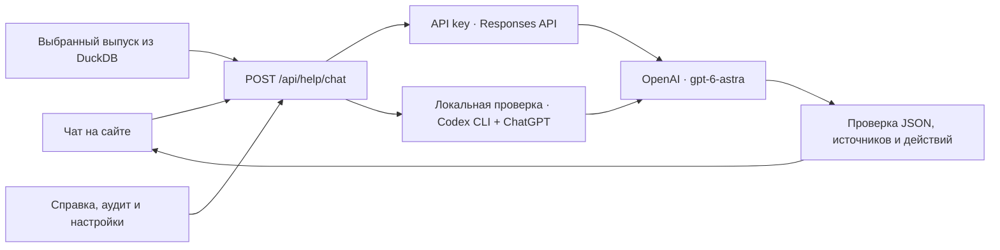

# Помощник Windcast

**Windcast — проект, RentBox — команда.** Помощник открывается кнопкой
«Помощник» в боковом меню сайта. Его модель — **OpenAI GPT-6 Astra**,
API-идентификатор `gpt-6-astra`. Подмена на NVIDIA или другую LLM не выполняется.

## Что умеет

- Объясняет, как рассчитать прогноз, открыть историю, проверить погоду и скачать CSV.
- Учитывает текущий раздел, дату начала прогноза, горизонт и выбранные турбины.
- Учитывает язык интерфейса и режим симуляции; синтетический сценарий не получает
  источники и CSV сохранённого реального прогноза. Обычная справка пока на русском.
- Получает состояние выбранного выпуска и сводку мощности непосредственно из backend.
- Поясняет смысл нормализованной мощности, метрик, as_of и предупреждений.
- Предлагает кнопки перехода по разделам и скачивания готового выбранного выпуска.

Чат не запускает обучение или прогноз самостоятельно. Для расчёта он направляет
в раздел «Прогноз». Пересчёт выполняется обычной кнопкой «Рассчитать прогноз».

## Подключение

Откройте `./run.sh settings` (или пункт **9 — Настройки OpenAI** в меню).
Мастер предлагает три режима:

| Режим | Для чего | Как работает |
|---|---|---|
| Аккаунт ChatGPT | Локальная проверка на своей машине | Использует существующий вход Codex CLI |
| API key | Развёртывание сервиса | Сервер обращается к OpenAI Responses API |
| Отключить ASTRA | Работа без внешнего LLM | На сайте остаётся «Справка платформы» |

### Через аккаунт ChatGPT

Нужен установленный Codex CLI с доступом к GPT-6 Astra. Мастер проверяет
`codex login status`; если входа нет, запускает обычный `codex login` с входом
через браузер. Используются текущие настройки пользователя `HOME`/`CODEX_HOME`.
Секреты входа не извлекаются и не копируются в `.env` или Docker.

```bash
./run.sh settings --mode chatgpt
./run.sh all
```

Этот режим предназначен **только для локальной проверки**: backend запускается
на хосте, где доступен Codex, backend и сайт слушают `127.0.0.1`. Если порт занят,
выбирается свободный; сайт подключается к нему автоматически. Уже запущенный
Docker не пересоздаётся. История этой проверки хранится отдельно в
`.run/chatgpt/forecasts.duckdb`, поэтому выпуски из Docker в ней не появятся.

Мастер сохраняет `OPENAI_HELPER_AUTH_MODE=chatgpt` и `OPENAI_HELPER_ENABLED=true`.
**Astra выполняется на серверах OpenAI**: локальными остаются сайт, backend и
Codex CLI. Видеокарта компьютера не используется для запуска этой модели.

### Через API key

В `./run.sh settings` выберите **API key**. На запрос «Вставьте токен OpenAI»
ввод скрыт. Ключ записывается в серверный `.env` с правами `600`, остальные
переменные сохраняются; ключ не передаётся в аргументах команд или в браузер.
Мастер также задаёт `OPENAI_HELPER_AUTH_MODE=api_key` и включает помощника.
Не отправляйте ключ в чат и не добавляйте его в Git.

После `./run.sh all` используется обычный запуск через Docker, если он доступен,
иначе — локальное окружение. Параметры по умолчанию:

```dotenv
OPENAI_BASE_URL=https://api.openai.com/v1
OPENAI_HELPER_ENABLED=true
OPENAI_HELPER_AUTH_MODE=api_key
OPENAI_HELPER_REASONING_EFFORT=low
OPENAI_HELPER_TIMEOUT_SECONDS=40
```

Модель фиксирована в backend: `gpt-6-astra`. Нужен доступ к ней у владельца ключа.
Можно задать другой HTTPS `OPENAI_BASE_URL` для предоставленного организаторами
совместимого сервиса Responses API; имя модели останется тем же.

Для обоих режимов откройте «Помощник» и задайте, например:
«Как скачать этот прогноз?» или «Что означают предупреждения про время?».
У ответа модели будет подпись «ASTRA · OpenAI». Готовность в статусе означает
наличие настройки; реальный доступ проверяется при вопросе.

Без ключа или входа, при таймауте, лимите или ошибке OpenAI показывается **«Справка платформы»**
с пояснением причины. Это обычные заранее написанные инструкции, а не ответ ASTRA.
Расчёт мощности и история работают независимо от внешних ключей.

Если другой процесс изменил порт уже работающего backend, выполните
`./run.sh web`: команда переподключает сайт к фактическому порту здорового
Compose-контейнера. В режиме ChatGPT используется записанный порт локального
backend. Сам backend эта команда не запускает и не пересоздаёт.
После смены способа входа нужен полный `./run.sh all`.

## Как обеспечивается точность

1. [Системный промпт](../backend/app/prompts/helper-system.md) задаёт роль,
   правила ответа, единицы измерения, временные ограничения и формат JSON.
2. [База справки](../backend/app/prompts/helper-knowledge.json) содержит сведения
   о существующих разделах. Она небольшая и передаётся целиком: векторная БД не нужна.
3. Сервер сам читает выпуск по `run_id`, актуальный аудит CSV и настройки времени.
   Числа и метрики из браузера не принимаются как факты. Отчёт января помечается
   как отчёт поставляемой модели, отдельно от текущего выбранного выпуска.
4. В режиме API key Responses API возвращает Structured Outputs; в режиме ChatGPT
   backend запускает `codex exec` с той же JSON-схемой. Сервер проверяет схему, модель,
   идентификаторы источников и действия; неизвестные ссылки или команды отклоняются.
5. Источники ответа и кнопки формируются сервером из разрешённого списка.
   Ответ отображается обычным текстом, без исполнения HTML или JavaScript.
6. История ограничена последними восемью сообщениями, вопрос — 2000 символами.
   Одновременно допускаются два запроса к OpenAI, не более 20 за минуту на процесс.

Системный промпт запрещает придумывать факт февраля, точность будущего прогноза,
номинальную мощность, причины неисправностей и отсутствующие функции.
Ограничения промпта и проверка схемы снижают риск ошибок, но не доказывают
истинность каждого сгенерированного предложения: спорное число следует сверить
с указанным источником. При изменении интерфейса обновляйте справку вместе с ним.

## Данные и реализация



API key хранится на сервере, вход ChatGPT — в штатном хранилище Codex.
В OpenAI уходят вопрос, ограниченная история,
справка и сводки; файлы исходных измерений целиком не отправляются.
В запросе через API key задано `store=false`; это параметр хранения Responses, а не обещание
об отсутствии обработки данных провайдером. История чата остаётся в памяти
браузера до перезагрузки и не записывается в DuckDB. Для режима ChatGPT действуют
настройки обработки данных соответствующего аккаунта.

Файлы: `backend/app/services/helper.py`, `backend/app/services/helper_codex.py`,
`scripts/configure_openai.py`, `backend/app/api/routes/helper.py`,
`backend/app/schemas/helper.py`, `apps/web/components/platform-helper.tsx`,
`apps/web/lib/helper-api.ts`. Версия промпта в ответе включает хэш правил и справки.
Контракт — [API.md](API.md#помощник-сайта-openai-astra).

Основание интеграции: [GPT-6 Astra](https://developers.openai.com/api/docs/models/gpt-6-astra),
[Responses и инструкции](https://developers.openai.com/api/docs/guides/text),
[Structured Outputs](https://developers.openai.com/api/docs/guides/structured-outputs).
Вход ChatGPT через браузер и ограничения публичного запуска Codex:
[официальная документация аутентификации](https://developers.openai.com/codex/auth).
